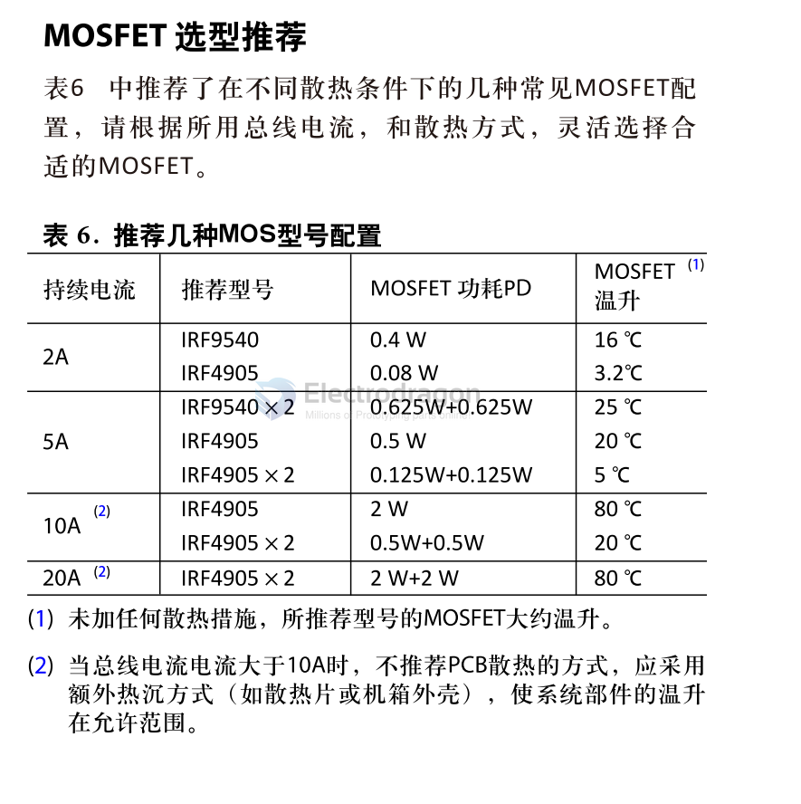

# mosfet-dat

| Model    | Mark | Manufactuers      |          | Descriptions                                |
| -------- | ---- | ----------------- | -------- | ------------------------------------------- |
| AOD403   | D403 | [[AOSMD-dat]]     |          |                                             |
| AOD4184A | 4184 | [[AOSMD-dat]]     |          | 40V N-Channel MOSFET                        |
| IRF540N  |      | [[[Infineon-dat]] |          |                                             |
| NCE6050  |      | [[ncepower-dat]]  | TO-252-2 | NCE N-Channel Enhancement Mode Power MOSFET |
| AO3401   | A19T | [[AOSMD-dat]]     |          |                                             |
| 2N7002   | 7002 |                   |          |                                             |
| SI2301   |      |                   |          |                                             |
| SI2307   |      |                   |          |                                             |
| IRF5305  | 5305 | [[Infineon-dat]]  |          |
| IRFR1205 |      | [[IOR-dat]]       |          |

## dual channel 

| Model   | Mark | Manufactuers     | Descriptions |
| ------- | ---- | ---------------- | ------------ |
| IRF8313 |      | [[Infineon-dat]] |

## high power mosfet 

## Parallel using Mosfet for higher performance 

## ref 

- [[mosfet]]