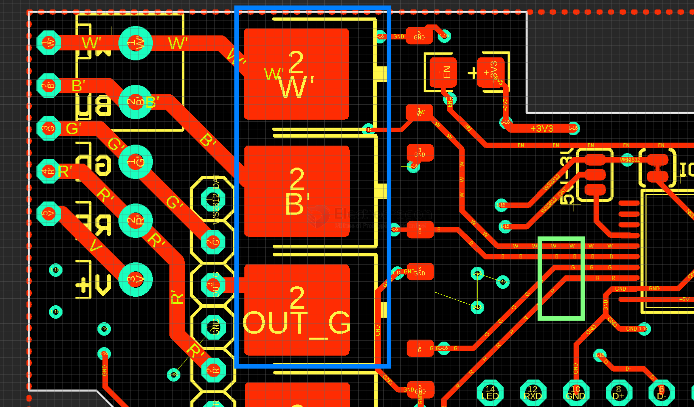

# mosfet-dimming-dat.md

# IRFR1205 LED Strip Dimming When Gate is Low — Full Analysis

## ⚠️ Problem
Your IRFR1205-controlled LED strip **dims slightly even when the gate is low (TTL level)**.  
That means the MOSFET is **not fully turning off** — it’s still leaking or partially conducting.

---

## 🔍 Likely Causes

| Cause | Explanation |
|--------|--------------|
| **1. Gate not truly at 0V** | MCU pin might be floating, or not configured as output-low. |
| **2. Gate resistor too large (1kΩ)** | Gate discharges slowly through 1k + 10k pull-down → MOSFET remains half-on for milliseconds. |
| **3. Wrong wiring (high-side N-MOSFET)** | If you placed MOSFET between +12V and LED, the body diode or floating source will let current through. |
| **4. Not a true logic-level MOSFET** | IRFR1205 needs ~10V for full off/on. At 5V logic, partial conduction occurs. |
| **5. Ground not shared** | If MCU and LED power supply grounds aren’t common, gate never reaches 0V relative to source. |
| **6. Slow switching** | Long RC constant causes the MOSFET to stay in linear region during PWM transitions, visible as dimming. |

---

## ⚗️ Quick Tests

1. **Short gate to ground**
   - Connect gate directly to GND (remove 1k temporarily).  
   - ✅ If dimming stops → gate drive is too weak or slow.

2. **Measure voltages**
   - Measure **Vgs = Vgate − Vsource** when “off”.  
   - It must be **< 0.3V** for full off.  
   - If Vgs = 0.5–1V → partial conduction.

3. **Ensure pin is output-low**
   - MCU pin should be actively set LOW (push-pull mode), not input or open-drain.

4. **Check wiring**
   - Correct low-side wiring:  
     ```
     +12V ─ LED +  
            LED − ─ Drain (IRFR1205)  
     Source ─ GND  
     MCU GND ─ same GND
     ```
   - If you connected it high-side, flip it as above.

---

## 🔧 Fixes

| Fix | Description |
|------|--------------|
| **Reduce gate resistor** | Change **1kΩ → 47Ω–100Ω**. Speeds up discharge and ensures full turn-off. |
| **Keep 10k pull-down** | Keeps gate at 0V when MCU pin is floating. |
| **Drive gate strongly low** | Set MCU pin mode to “output” and write LOW. |
| **Check power wiring** | Ensure common ground between MCU and 12V LED supply. |
| **Use correct switch side** | IRFR1205 should be **low-side** switch only (drain to LED−, source to GND). |
| **Use better MOSFET for 5V logic** | Replace with a true logic-level FET (e.g. **IRLZ44N**, **AOZ1284**, **AO3400**, **AOD4184A**). |
| **Use gate driver if needed** | For high current or PWM, use a driver that outputs 10–12V gate voltage. |

---

## ⚙️ Example Test Results (Typical)

| Condition | Gate Resistor | Dimming | Cause |
|------------|----------------|----------|--------|
| 1kΩ + 10k pull-down | Yes | Gate discharges too slowly |
| 100Ω + 10k pull-down | No | Fast edge, full off |
| Gate tied directly to GND | No | Confirms slow discharge or drive issue |
| 5V logic drive, high current load | Slight dim | MOSFET not fully enhanced |
| 10V gate drive | None | Fully enhanced and fast off |

---

## ✅ Recommended Setup

```
+12V ─ LED strip +
LED strip − ─ Drain
Source ─ GND
MCU pin ──100Ω── Gate
Gate ──10k── GND
(MCU and 12V share ground)
```


Optional:
- Add **flyback diode** if LED strip has inductive components.
- Add **small 100nF cap** across LED for smoother PWM fading.

---

## 🧠 Conclusion

Your LED dimming when the gate is low means:
- The gate isn’t discharging fully or fast enough.  
- The IRFR1205 isn’t fully off at 5V logic.  

**Solutions:**  
→ Lower gate resistor to **47–100Ω**,  
→ Ensure gate goes to **0V**,  
→ Use a **logic-level MOSFET** or **10V gate driver** if current is high.




## ref 

- [[mosfet-dat]]