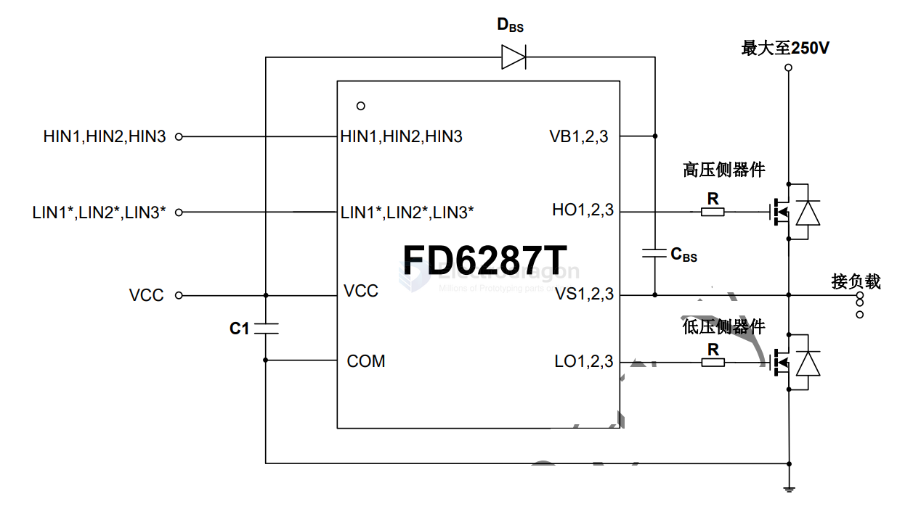
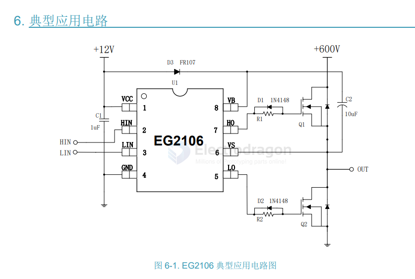

# mosfet-driver-dat

- [[mosfet-dat]] - [[mosfet-arrary-dat]] - [[mosfet-driver-dat]]

- [[ESC-dat]] - [[VESC-dat]] - [[motor-driver-dat]] - [[FOC-dat]]

- [[UCC27324-dat]] - [[mosfet-driver-dat]]

UCC27324-Q1 Dual 4-A Peak High-Speed Low-Side Power MOSFET Driver

## TC4451/TC4452

TC4451/TC4452 == 12A High-Speed MOSFET Drivers

The TC4451/TC4452 are single-output MOSFET drivers. These devices are high-current buffers/drivers capable of driving large MOSFETs and insulated gate bipolar transistors (IGBTs). The TC4451/TC4452 have matched output rise and fall times, as well as matched leading and falling-edge propagation delay times. The TC4451/TC4452 devices also have very low crossconduction current, reducing the overall power dissipation of the device.

- [[microchip-dat]]

## FD6287 / FD6288 

- [[mosfet-dat]] - [[mosfet-driver-dat]] - [[FD6287-dat]] - [[fortior-dat]] - [[FD6288-dat]]

SCH 

## EG Micro EG2106

MOSFET driver IC - Low Side High Side Gate Driver IC MOSFET SOIC-8

## ref 

- [[mosfet-dat]]