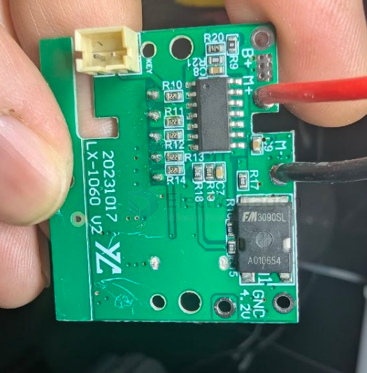

# mosfet-power-dat

- [[mosfet-power-dat]] - [[mosfet-dat]]

- [[vishay-dat]] - [[ST-dat]]

IRFB11N50A - 500V, 11A, N-Channel Power MOSFET

STP11NK50Z - N-channel 500 V, 0.48 Ω , 10 A TO-220, TO-220FP, D2PAK Zener-protected SuperMESHTM Power MOSFET

- [[Feeling-Technology-dat]] - [[FP6291-dat]] - [[mosfet-power-dat]] - [[fuman-dat]]

VDS = 30V,ID =86A

FM 3090SL / CMD3090L / SLD3090T

## ref 

