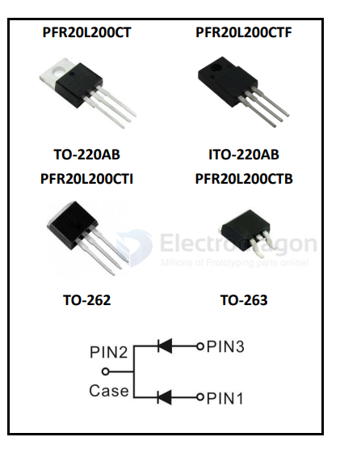
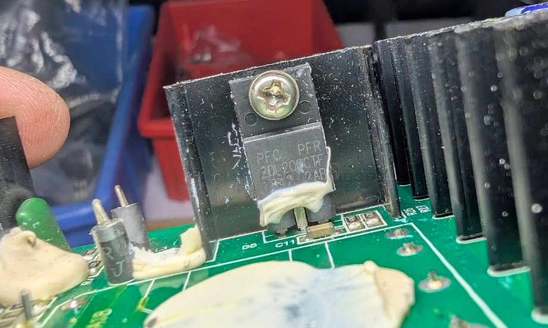

# rectifier-dat

- [[rectifier-dat]] - [[diode-rectifier-dat]] 

- [[CR6842-dat]] - [[Center-Tapped-Full-Wave-rectifier-dat]]

- [[lamp-dat]] - [[S4220-dat]] - [[rectifier-dat]] - [[led-driver-dat]]

MicrosemiCatalog Number

- * S4210 - 100V 
- * S4220 - 200V 
- * S4230
- * S4240
- * S4250
- * S4260
- * S4280
- * S42100
- * S42120
- * S42140
- * S42160 - 1600V 

- [[PFC-dat]] 

PFC PFR 20L200CTF - 20A 200V MOS Schottky Rectifier

The `PFR20L200CTF` (commonly searched as PFC FPR 20L200CTF) is a 20A, 200V MOS Schottky rectifier manufactured by PFC Device Corp. It features an ultra-low forward voltage drop and comes in an insulated plastic package

## ref 

