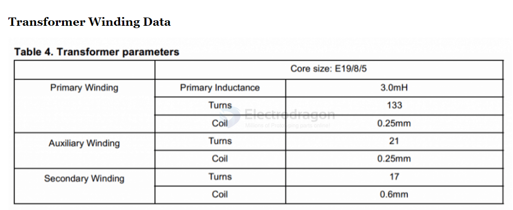
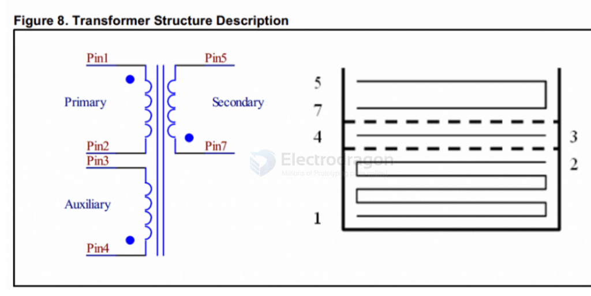
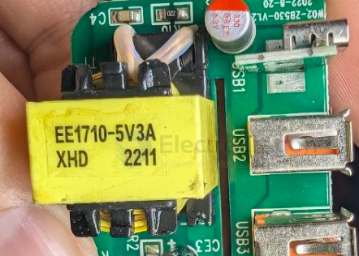

# transformer-dat

- [[ACDC-dat]] - [[VIPER22-dat]]

## transformer specs 

for - [[VIPER22-dat]]

- Primary Winding
- Auxiliary Winding
- Secondary Winding

## wiring 

The transformer winding is actually quite straightforward, and may be done in the following manner. 

Keep in mind that the `black dots` indicate the start points of the winding which is very important, and must be strictly followed while winding the transformer.

- The primary wound using 36 SWG super enameled copper wire upto `150 turns`, 
- while the secondary is wound using 26 SWG wire upto around `12 to 15 turns`.

The core can be a standard `E19` type ferrite core having a bobbin with central core cross section area of approximately 4.5mm by 4.5mm.

- [[E19-dat]]

## build 

EE1710-5V3A

XHD 2211

- **EE1710 (or EE17)**: Core type and physical size.
  - **EE**: Standard "E-E" shaped ferrite core.
  - **1710**: Dimensions (approx. 17mm width).
- **5V3A**: Electrical output rating.
  - **5V**: Output voltage.
  - **3A**: Maximum current.
  - **Total Power**: 15W ($5\text{V} \times 3\text{A} = 15\text{W}$).
- **XHD**: Series name or manufacturer prefix (2.5mm pitch).
- **2211**: Date code / batch code.
  - **22**: Year (2022).
  - **11**: Calendar week (mid-March).

## ref 