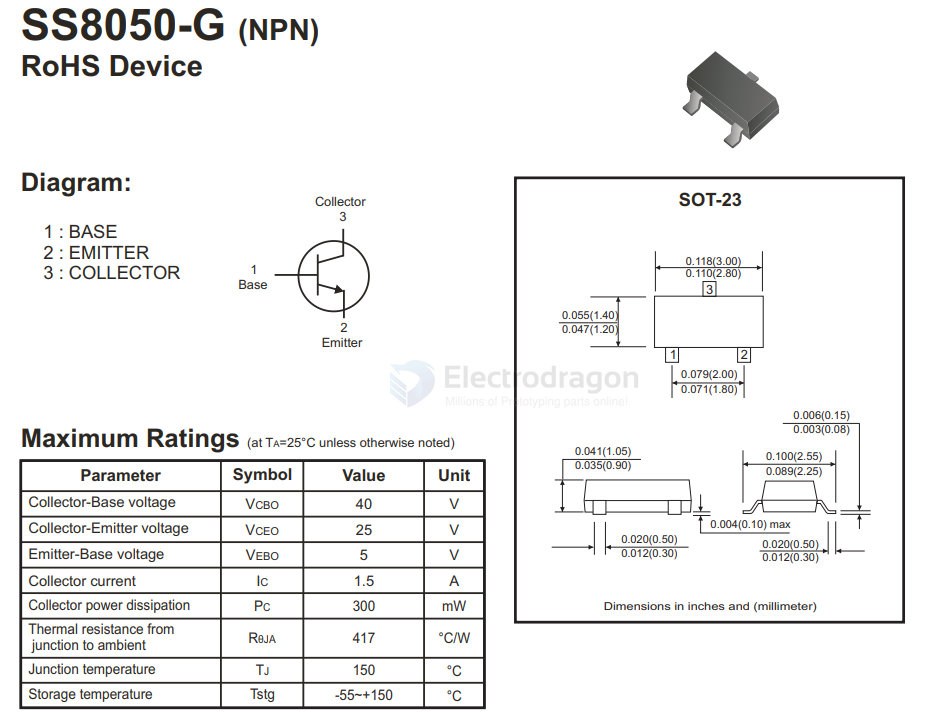

# S8050-dat

## SS8050 vs S8050 

Short answer: Yes — if the **load current** is within S8050 limits (typically **≤ ~0.5–0.7 A** depending on vendor).

- Voltage: **12 V is OK** (Vce(max) ≈ 25 V).  
- Current: keep **Ic ≤ ~0.5 A** (check vendor datasheet).  
- Base drive: use **Ib ≈ Ic/10** for saturation; **Rb = (Vdrive − Vbe)/Ib**.  
- Inductive loads: **add flyback diode**.  
- If Ic > ~0.4–0.7 A (continuous) → use **SS8050** (if rated) or better a **logic-level N-MOSFET**.

## SOT-23

## S8050 NPN Transistor Truth Table

| Base (B) | Collector (C) | Emitter (E) | Transistor State | Collector-Emitter Current |
|:--------:|:-------------:|:-----------:|:----------------:|:------------------------:|
|   LOW    |     HIGH      |    LOW      |    OFF (Cutoff)  |           0              |
|   HIGH   |     HIGH      |    LOW      |   ON (Saturation)|        Flows (ON)        |

**Notes:**
- **Base HIGH**: A small current applied to the base (typically >0.7V above emitter) turns the transistor ON, allowing current to flow from collector to emitter.
- **Base LOW**: No base current keeps the transistor OFF, and no current flows from collector to emitter.
- **Collector is usually connected to a positive voltage, emitter to ground.**

## ref 

- [[transistor-dat]]