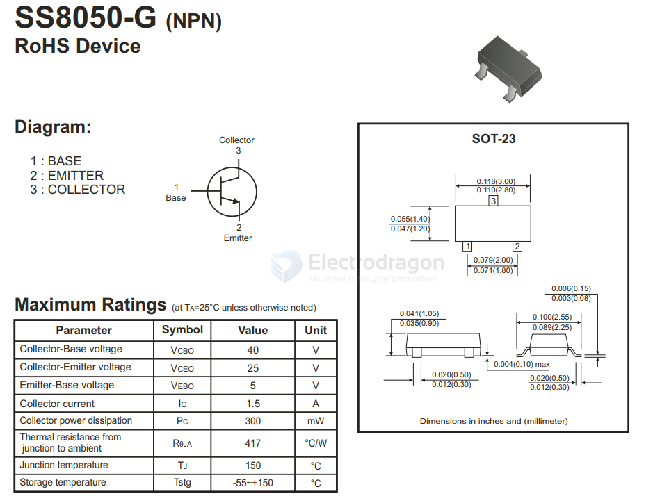
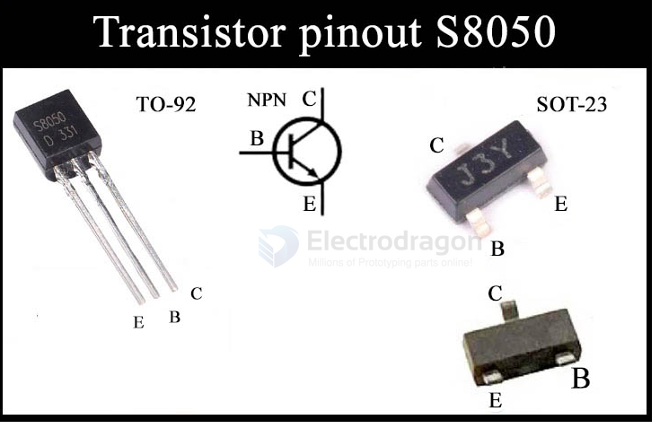

# S8050-dat

`SS8050` == Y1 
`S8050` == J3Y

## SS8050 vs S8050 

Short answer: Yes — if the **load current** is within S8050 limits (typically **≤ ~0.5–0.7 A** depending on vendor).

- Voltage: **12 V is OK** (Vce(max) ≈ 25 V).  
- Current: keep **Ic ≤ ~0.5 A** (check vendor datasheet).  
- Base drive: use **Ib ≈ Ic/10** for saturation; **Rb = (Vdrive − Vbe)/Ib**.  
- Inductive loads: **add flyback diode**.  
- If Ic > ~0.4–0.7 A (continuous) → use **SS8050** (if rated) or better a **logic-level N-MOSFET**.

## SOT-23

SOT-23 == 123 == BEC 

Specifications

Let’s start with the maximum possible values, exceeding these parameters is unacceptable and leads to the transistor failure. All maximum S8050 specifications were measured at ambient temperature +25°C, here they are:

- voltage between C-B VCBO (Ucb max) – 40 V;
- voltage between C-E VCEO (Uce max) – 25 V;
- voltage between E-B VEBO (Ueb max) – 5 V;
- current through collector IC (max):
     - in SOT-23 package IC (max) – 500 mA;
     - in TO-92 package IC (max) – 700 mA.
- power, dissipated at collector junction
- in SOT-23 package Pk 300 mW;
- 1 W in TO-92 package
- allowable crystal temperature +150 °С;
- operating temperature from -55 to +150°C.

Also important parameters to pay attention to are the electrical specifications. They were measured at a temperature of +25°C. The other values are given in a separate column of the table, which is called “Measurement modes”.

## S8050 NPN Transistor Truth Table

| Base (B) | Collector (C) | Emitter (E) | Transistor State | Collector-Emitter Current |
|:--------:|:-------------:|:-----------:|:----------------:|:------------------------:|
|   LOW    |     HIGH      |    LOW      |    OFF (Cutoff)  |           0              |
|   HIGH   |     HIGH      |    LOW      |   ON (Saturation)|        Flows (ON)        |

**Notes:**
- **Base HIGH**: A small current applied to the base (typically >0.7V above emitter) turns the transistor ON, allowing current to flow from collector to emitter.
- **Base LOW**: No base current keeps the transistor OFF, and no current flows from collector to emitter.
- **Collector is usually connected to a positive voltage, emitter to ground.**

## ref 

- [[transistor-dat]]