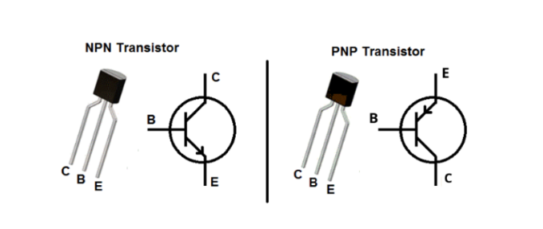
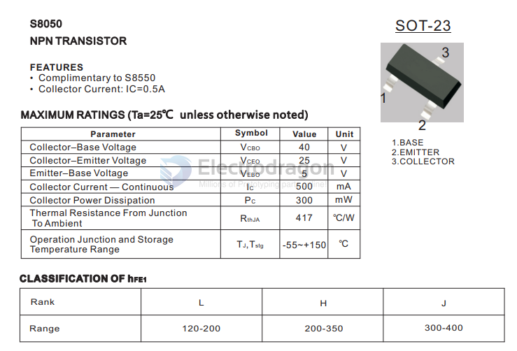
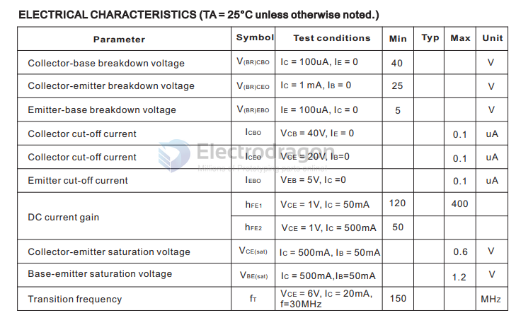
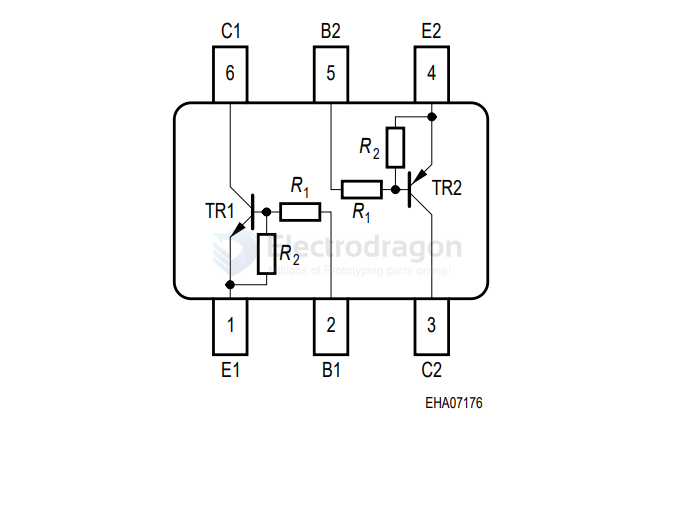
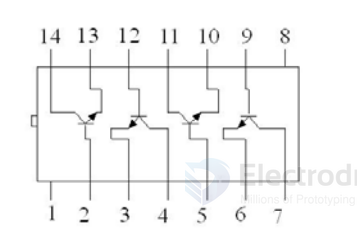

# transistor-dat

- [[FET-dat]] - [[transistor-array-dat]] - [[S8050-dat]]

common brand: 	Infineon

- similar - [[mosfet-dat]]

## types 

- ref - https://www.censtry.com/blog/transistor-npn-vs-pnp-difference-between-pnp-and-npn-transistor.html

[[transistor-array-dat]]

## common used 

### S8050 

- [[relay-dat]] drive 

- S8050 SOT-23 footprint = BC817

| pin | name      | common   |
| --- | --------- | -------- |
| 1   | base      | io input |
| 2   | emittor   | gnd      |
| 3   | collector | output   |

### infineon

#### IRLML6244 

- [irlml6244-DS](https://www.infineon.com/cms/en/product/power/mosfet/n-channel/irlml6244/)
- 20V Single N-Channel StrongIRFET™ Power MOSFET in a SOT-23 package

## transistor array 

### dual transistor package 

#### BCR 10PN H6327

- Two (galvanic) internal isolated NPN/PNP Transistors in one package
- Built in bias resistor NPN and PNP (R1=10 kΩ, R2 =10 kΩ)
- [URL](https://www.mouser.jp/datasheet/2/196/bcr10pn-223935.pdf)

### other 

1HT251 NPN Silicon Planar Low Power Transistor Array == 4x

## BSS138 

# Differences Between BSS138 and BSS138W

| Feature                  | BSS138                          | BSS138W                          |
|--------------------------|---------------------------------|----------------------------------|
| Device Type              | N-Channel MOSFET                | N-Channel MOSFET                 |
| V_DS (Drain–Source) Max  | 50 V                            | 50 V                             |
| I_D (Continuous Drain)   | ~200 mA (at 25°C)               | ~200 mA (at 25°C)                |
| R_DS(on)                 | ~3–5 Ω @ V_GS = 4.5 V           | ~3–5 Ω @ V_GS = 4.5 V            |
| Gate Threshold (V_GS(th))| 0.7–1.3 V                       | 0.7–1.3 V                        |
| Package                  | **SOT-23 (larger)**             | **SOT-323 / SC-70 (smaller)**    |
| Size / Footprint         | 2.9 × 1.3 mm (approx.)          | 2.0 × 1.25 mm (approx.)          |
| Thermal Dissipation      | Better (due to bigger package)  | Lower (due to smaller package)   |
| Pinout                   | Same function (G, D, S)         | Same function (G, D, S)          |

## Key Points
- **Electrical specs are essentially identical** → Both are 50V N-channel enhancement MOSFETs.  
- **Main difference = package size**:  
  - **BSS138** → SOT-23, larger, easier to hand-solder, better thermal handling.  
  - **BSS138W** → SOT-323 (SC-70), much smaller, designed for high-density PCBs.  
- **Thermal performance**: BSS138 can dissipate a bit more heat than BSS138W.  

👉 If space is tight → **BSS138W**.  
👉 If you want easier soldering and better heat dissipation → **BSS138**.

## un-sorted 

- [BCR116E6327](https://www.mouser.com/ProductDetail/Infineon-Technologies/BCR-116-E6327?qs=OWKQh20churs%252Bj9jXRGlFg%3D%3D&srsltid=AfmBOoq-frf2cIVFR5tG9npa_zhflZxKBJ_wqftDIDK69ALQzAtPfXW6) == Built in bias resistor (R1=4.7 kΩ, R2=47 kΩ) == Infineon == BCR 116 E6327

- IRFML8244TRPBF

- IRLML9303 

- BC817-40W - 45 V, 0.5 A, General Purpose NPN Transistor

PBSS5350Z - 50 V, 3 A PNP low VCEsat transistor

## ref 

- [[kicad-dat]]

- [[transistor]] - [[mosfet-dat]]