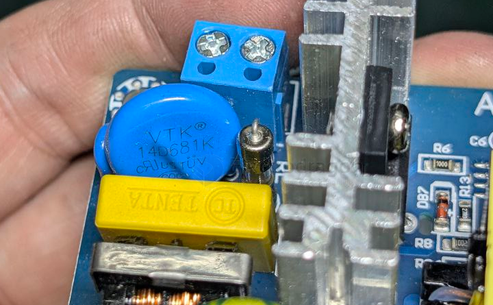

# varistor-dat

## GMOV-14D151K 

GMOV-14D151K == VARISTOR 6KA DISC 14MM

Bourns combines its patented GDT with FLAT® technology and a Metal Oxide Varistor (MOV) to create a new and innovative GMOV™ Series Hybrid Protection Component. By combining the best features of both MOV and GDT technologies, the GMOV™ Series achieves high performance as a long life protector with low capacitance and, most importantly, very low leakage. The GMOV™ Series is ideally suited for any number of AC and DC power applications where a high level of performance is required over time.

## COV 14D681K

VARISTOR 612V~748V 4.5kA P=7.5mm

612V~748V 4.5kA Varistor Through Hole,P=7.5mm

## ref 

- [[BOM-dat]]