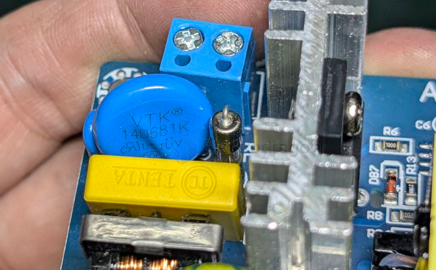

# varistor-dat

== MOVs 

- [[varistor-dat]] - 561KD10 - Varistors MOV Disc 10mm, 560V 2.5KA, Bulk - [[power-adapter-dat]]

The 561KD10 is a 10mm radial lead Metal Oxide Varistor (MOV) manufactured by YAGEO (or Brightking). It is an electrical overvoltage protection device designed to clamp sudden voltage spikes and protect sensitive electronic circuits.

Key Specifications

- Varistor Voltage: 560 V (operating at ± 10%)
- Clamping Voltage: 925 V
- Max Voltage Rating: 350 VAC / 460 VDC
- Surge Current: 2.5 kA (2500 A)
- Disc Diameter: 10 mm

Common Applications
- AC power supplies and surge protectors
- Telecom equipment and smart meters
- Circuit breakers and industrial automation
- General consumer electronics

10D471K 

07D471K

Using `10D471K` as the primary example:

`10 (or 07)`: This indicates the disk diameter in millimeters.

`10D` = 10mm diameter.

`07D` = 7mm diameter.

## GMOV-14D151K 

GMOV-14D151K == VARISTOR 6KA DISC 14MM

Bourns combines its patented GDT with FLAT® technology and a Metal Oxide Varistor (MOV) to create a new and innovative GMOV™ Series Hybrid Protection Component. By combining the best features of both MOV and GDT technologies, the GMOV™ Series achieves high performance as a long life protector with low capacitance and, most importantly, very low leakage. The GMOV™ Series is ideally suited for any number of AC and DC power applications where a high level of performance is required over time.

## COV 14D681K

VARISTOR 612V~748V 4.5kA P=7.5mm

612V~748V 4.5kA Varistor Through Hole,P=7.5mm

## ref 

- [[BOM-dat]]