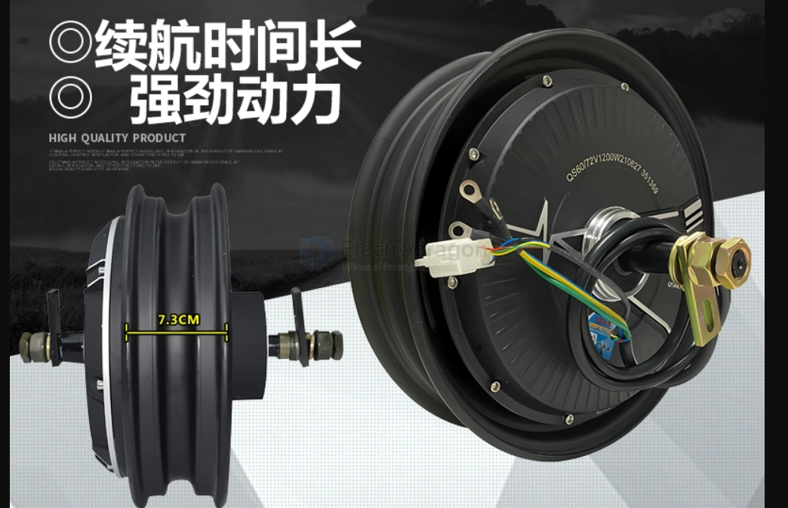
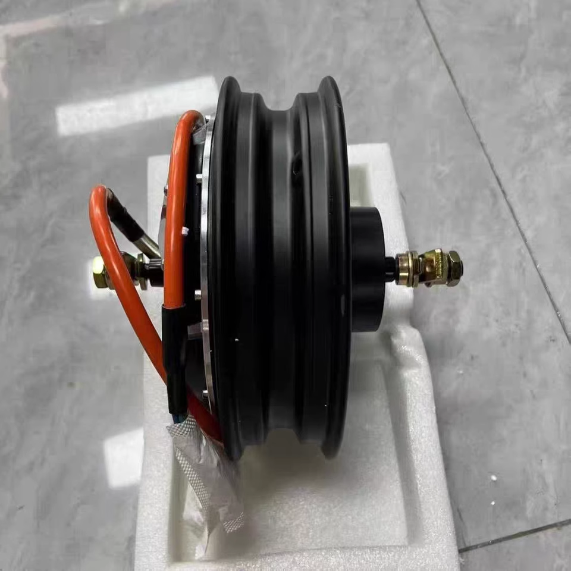
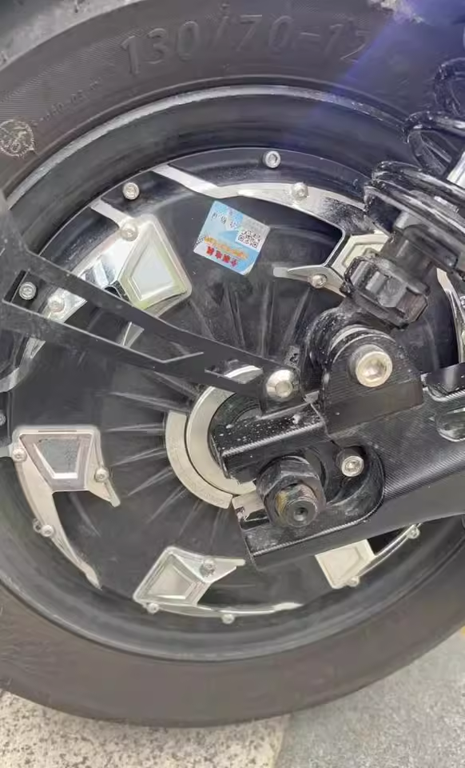
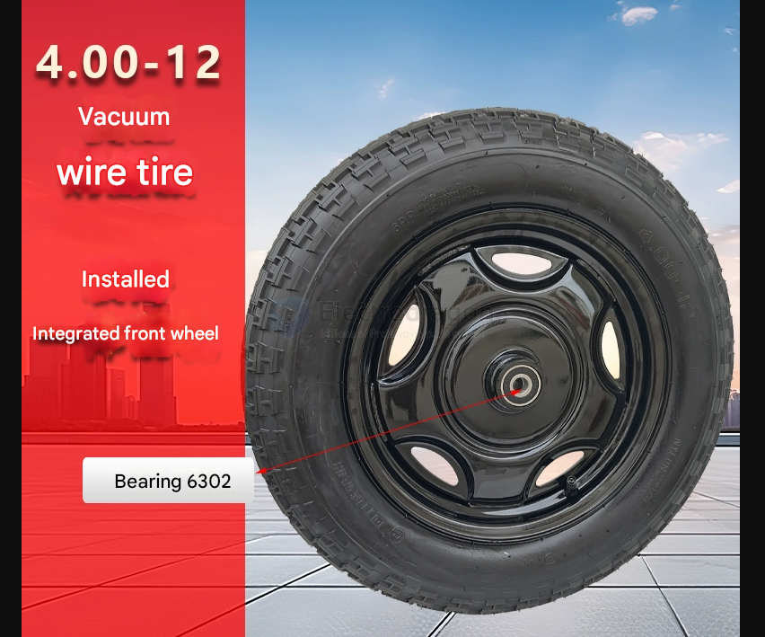

# wheel-dat

## Mecanum wheel == omnidirectional wheel

- [Mecanum wheel](https://en.wikipedia.org/wiki/Mecanum_wheel) - Wikipedia

The Mecanum wheel is a type of omnidirectional wheel that allows a vehicle to move laterally, diagonally, or rotate in place without changing its orientation. It is widely used in omnidirectional robots, AGVs (Automated Guided Vehicles), and mobile robotics applications.

## wheel with motor 

12-inch 3000W 18-shaft + Mingzhe semi-molten tire

## wheel without motor 

bearing 6302

## ref 

- [[robot-dat]]

- [[bearing-dat]]

