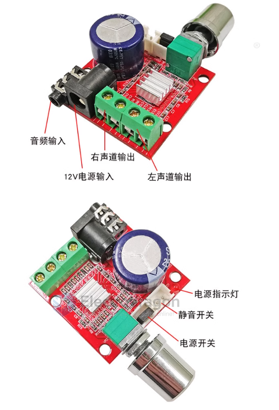

# AMP1000-dat

- [[PAM8610-dat]] - [[diodes-dat]]

- 音频输入 = AUX
- 12V电源输入 = power supply 12V
- 右声道输出 right-channel output 
- 左声道输入 left-channel output 
- 电源指示灯 = power indicator
- 静音开关 = mute
- 电源开关 = power on/off 

## ref 

- [[AMP1000]]