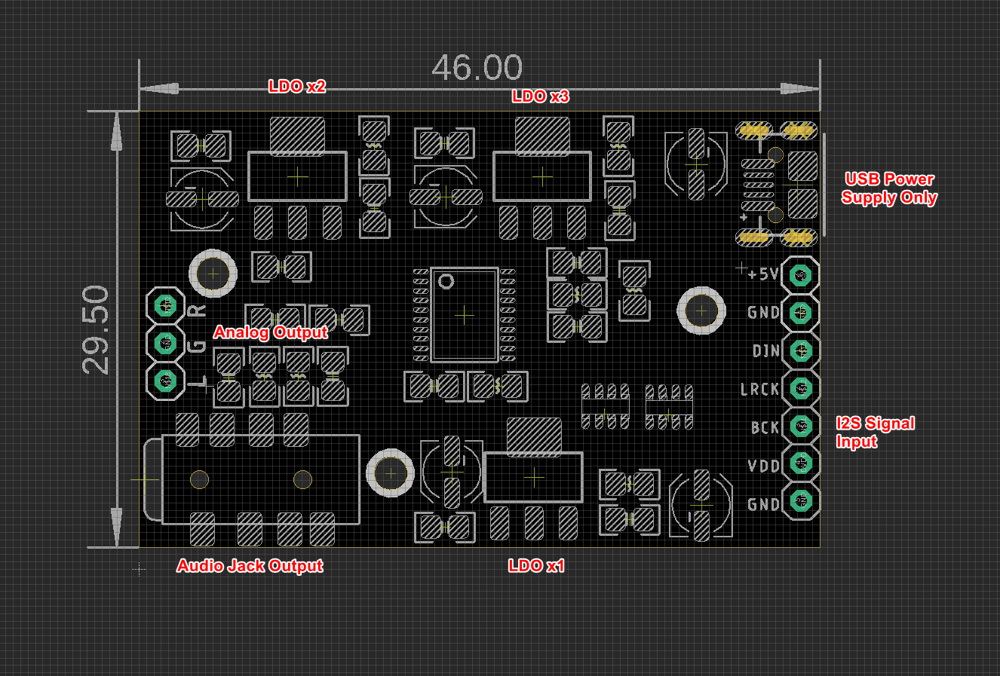

# AMP1006-dat

- legacy wiki page - for wiring - https://www.electrodragon.com/w/Sound_Card

- [[NBL1084-dat]] - [[NBL1084-dat]] - [[NBL1085-dat]]

## Board Size 

Seperated LDO power supply for: 
- AVDD = LDO x1
- DVDD = LDO x3
- 3V3 - CPVDD

## Function setup 

- XSMT - pull high = Left justified (High)
- FMT - pull ground = Soft mute (Low)
- FLT - pull ground = Normal latency (Low)
- DEMP - pull ground = De-emphasis control for 44.1kHz sampling rate(1): Off (Low)

## Logs 

- R2 version silghly change board layout, all functions remain the same.

## ref 

- [[PCM5102-dat]]

- [[I2S-dat]]

