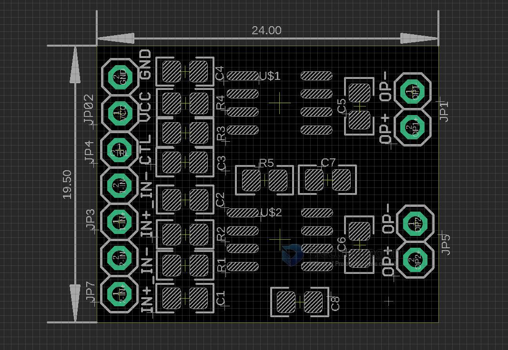

# AMP1021-dat

### Bom List:

| name  | value                                  |
| ----- | -------------------------------------- |
| R5    | 0R, remove this you need CTRL function |
| R1-R4 | 12K                                    |
| C1-C4 | 104                                    |
| C5-C8 | 105                                    |
| VCC   | 3.6-6.5V                               |

test current max. at ~ 250mA - 300mA

- JP7 = IN+ IN- 
- JP3 = IN+ IN- 
- JP4 = CTRL 
- JP2 = VCC GND
- JP5 = OP+ OP- 
- JP1 = OP+ OP- 

IN+ for single-end input, IN- to ground 

## demo 

Esp32 tone test with amplifier ht6872 #demo

https://t.me/electrodragon3/332

## ref

- [[NBL1054-dat]] - [[HT6872-dat]]
