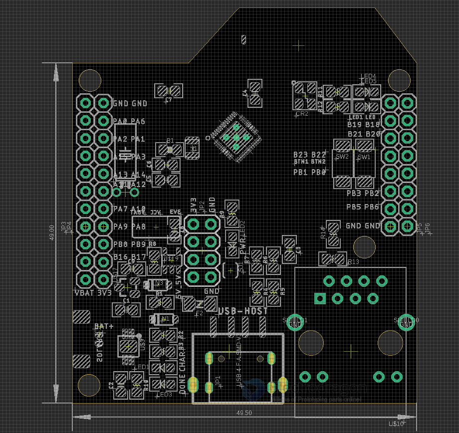

# ARM1003-dat

- legacy wiki page - https://w.electrodragon.com/w/CH579

## Board Map 

power distributation please see this page [[Power-distribution-dat]]

## Pin Definitions 

- PB22 - PROG Pin 
- PB23 - Reset Pin 
- LED1 - next to PB18, connect by a jumper
- LED2 - next to PB19, connect by a jumper
- UART1 = PB8 / PB9 
- UART0 = 

## ref 

- [[ethernet-dat]] - [[BLE-dat]] - [[USB-dat]]

- [[WCH-dat]] - [[CH579-dat]] - [[WCH-MCU-dat]] - [[WCH-PROG-dat]]

- official SDK - https://www.wch.cn/products/ch579.html
- https://github.com/Edragon/WCH_CH579.git

