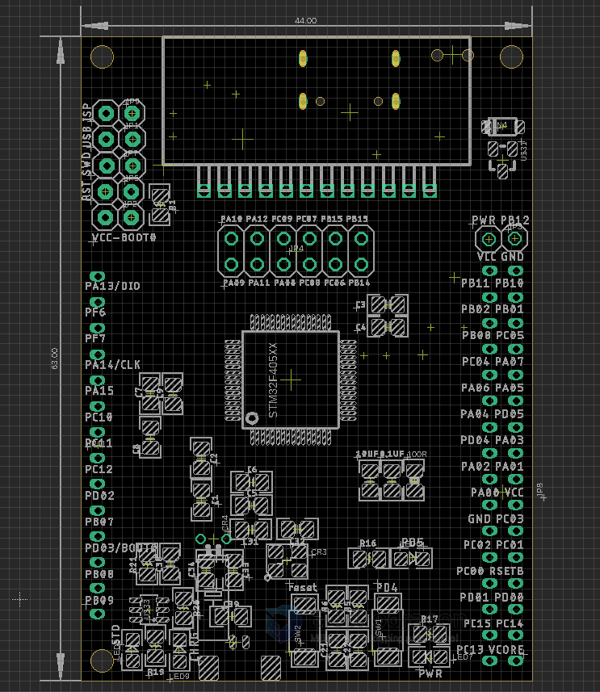
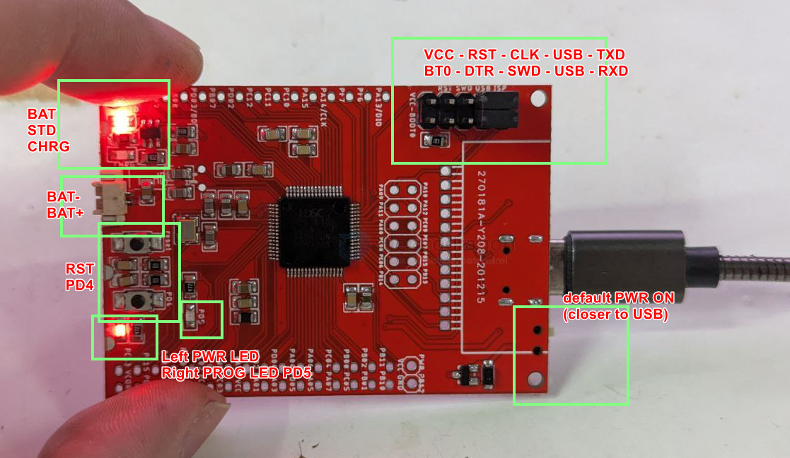

# ARM1007-dat

[HC32L136 Low-Power Cortex-M0+ Mini Dev. Board](https://www.electrodragon.com/product/hc32l136-low-power-cortex-m0-mini-dev-board/)

- [legacy wiki page ](https://w.electrodragon.com/w/HDSC_SDK)

## Board map 

- [[segment-LCD-dat]] - [[battery-charger-dat]] - [[serial-dat]] - [[LDO-dat]]

- [[peripherals-dat]] - [[MCU-dat]]

## USB-TTL selection (on the top left pins)

[[SWD-dat]]

- PA13 - UART0_RXD
- PA14 - UART0_TXD

[[ISP-dat]]
- PA09 - UART0_TXD
- PA10 - UART0_RXD

misc
- chip reset - USB_DTR

BOOT0
- default pull down / or jumper pull up

## Power supply 

- by back jumper: +5V or 3V3
- power ON/OFF: by backside top right switch 
- [[Power-distribution-dat]]: select power via USB or battery 

- [[power-dat]]

## Programmer IOs 

- button: reset / PD4
- LEDs: PD5

## demo code 

- hc32l13x_ddl_Rev1.9.1 Lite.zip
- HC32L136_DDL_Rev1.2.0(该版本停止官方更新，如有更新升级需要，请联系销售窗口.zip

SDK 
- HC32L136_IDE_Rev1.0.0.zip

available at - https://github.com/Edragon/MCU-HDSC-SDK-HC32L136

- [[MDK-ARM-dat]]

## demo video 

## ref 

- [[HC32L136-dat]] - [[HDSC-dat]]

- [[Power-distribution]]