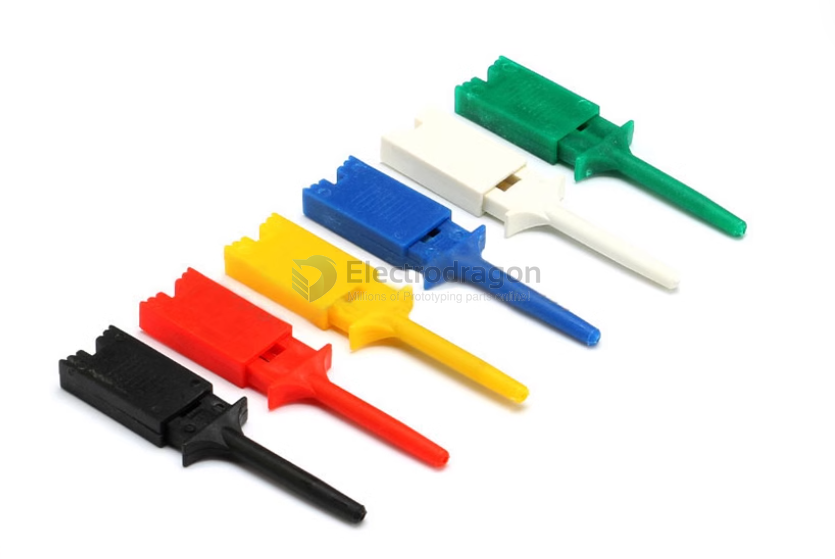
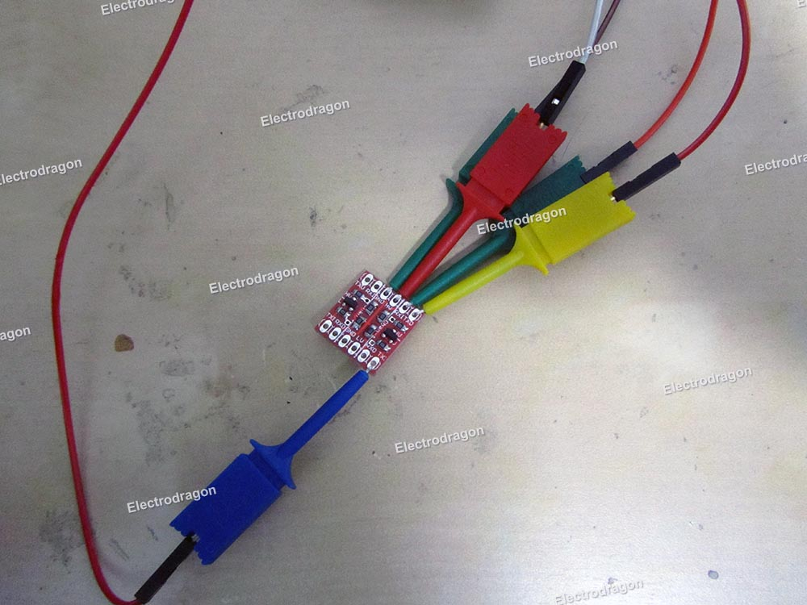
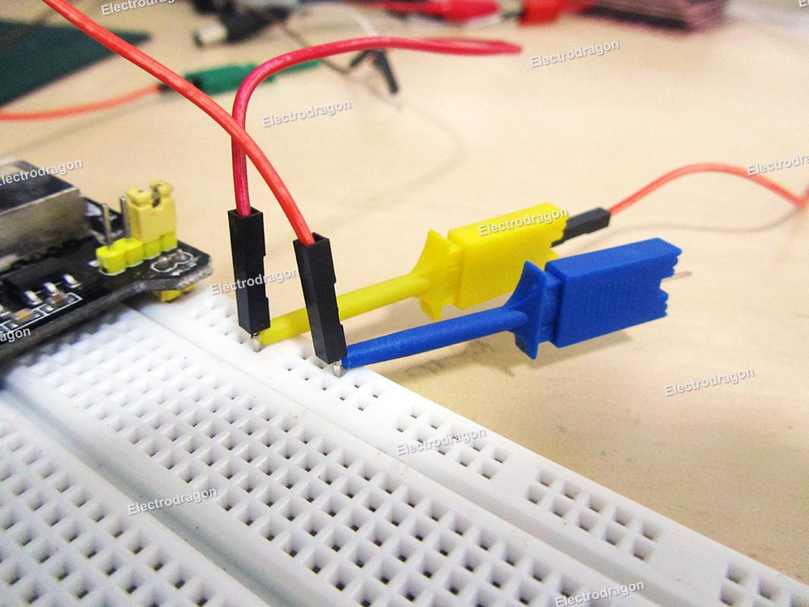

# CCO3524-dat

When measuring circuits or components, if you use a multimeter pen, you must hold the pen with your hand to measure. If you use a test hook, you can hook the component pin with the hook of the test hook and then measure. Using the test groove can free your hand from the measurement.

## color series 

## features 

1. Used when testing power supply for precision circuits. It is a good tool to connect a line and use it with a power supply or multimeter.
2. There is a spring at the front end of the clip, which is retractable. The clip has strong elasticity and can firmly clamp objects.
3. Stainless steel metal sheet, higher conductivity, welded;
4. Built-in spring, can firmly hook the test contact.
5. Good protection performance, can prevent short circuit caused by foot contact, 50mm long

## use guide 

