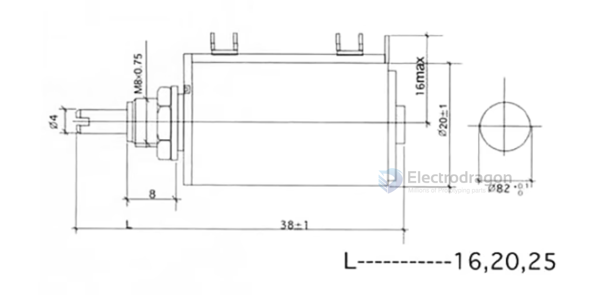
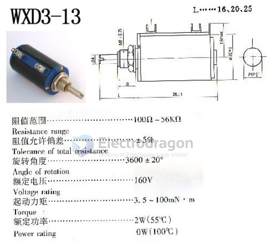
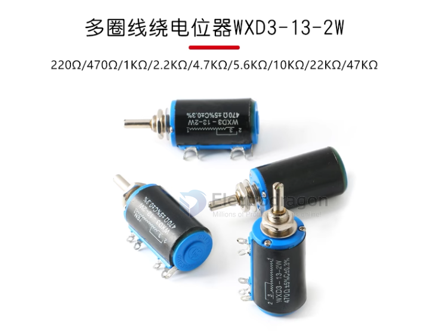
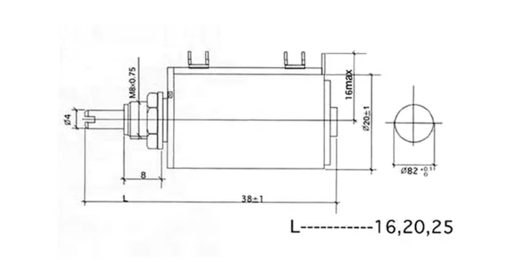
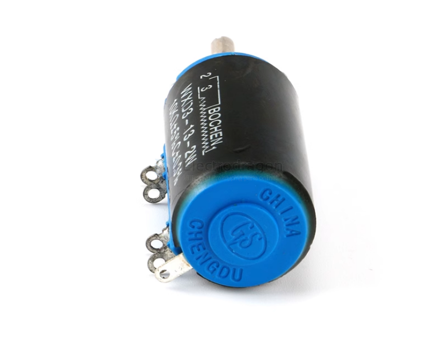

# CKI1083-dat 

## Our selling versions 

- CKI1080 - 1K
- CKI1081 - 4.7K
- CKI1082 - 10K
- CKI1083 - 47K 

https://www.electrodragon.com/product/wxd3-13-2w-10k-ohm-multiple-circles-potentiometer/?attribute_pa_resistor-value=47k

## Data 

Dimension

Specs 

Appearance 

https://www.electrodragon.com/product/wxd3-13-2w-10k-ohm-multiple-circles-potentiometer/

WXD3-13-2W 10K

## ref 

- [[CKI1080-dat]] - [[CKI1081-dat]] - [[CKI1082-dat]] - [[CKI1083-dat]] - [[resistor-trim-pot-dat]]
