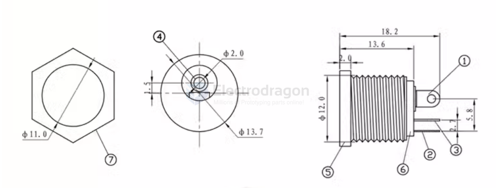

# CPP1012-dat

- Temperature: -40~55°C
- Rated load: DC30V0.5A
- Contact resistance: ≤0.03Ω
- Insulation resistance: ≥100mQDC250V
- Withstand voltage: AC500V (50Hz)min
- Plug-in force: 3~20N
- Mechanical life: 5000 times

## dimension 

## ref 

- [[CPP1012]]