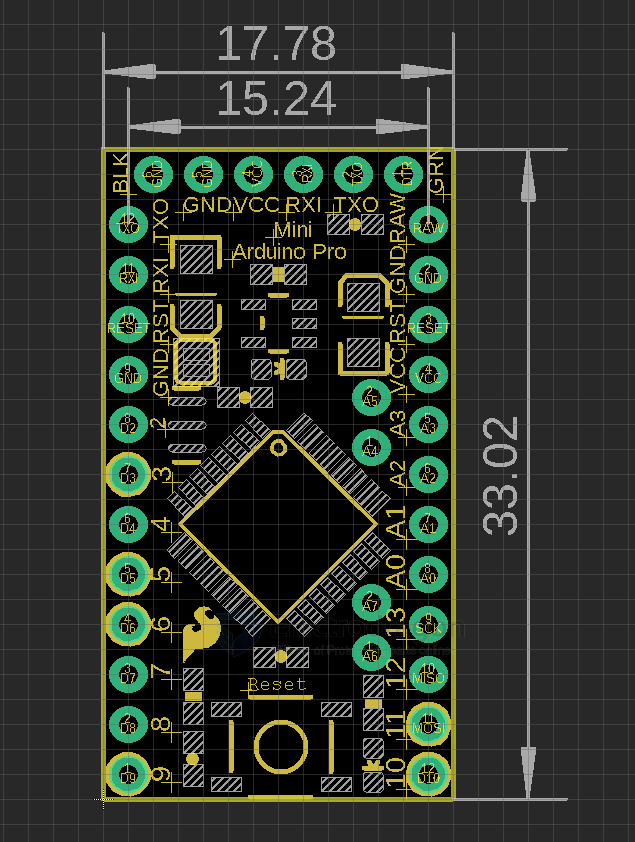

# DAR1010-dat

- [SCH](http://dlnmh9ip6v2uc.cloudfront.net/datasheets/Dev/Arduino/Boards/Arduino-Pro-Mini-v12.pdf) 
- [SCH-LINK2](https://www.arduino.cc/en/uploads/Main/Arduino-Pro-Mini-schematic.pdf)
- [EAGLE FILES](https://www.arduino.cc/en/uploads/Main/arduino-pro-mini-reference-design.zip)
- [official reference page.](https://docs.arduino.cc/retired/boards/arduino-pro-mini#osh-schematics)
- [get started tuto page. ](http://www.arduino.cc/en/Guide/ArduinoProMini)

Series - [[edarduino-dat]]

## Version 

DAR1007 - Crystal 8mhz marked as 0.08 and regulator silk print is 9b27. 
DAR1010 - crystal 16mhz marked as AR, and regulartor silk print is S8MF

## dimension 

## ref 

- [[DAR1010]]