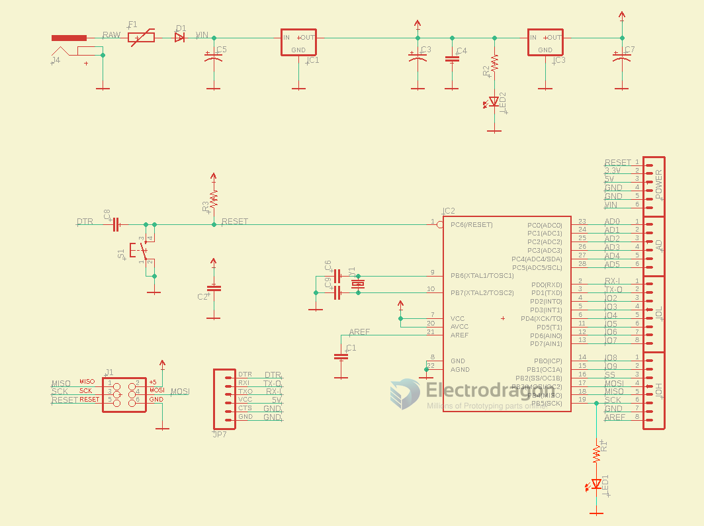
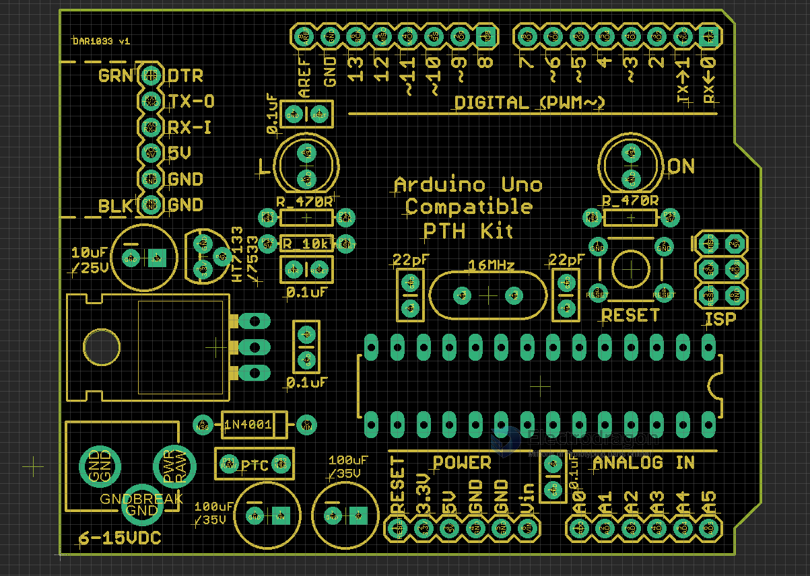
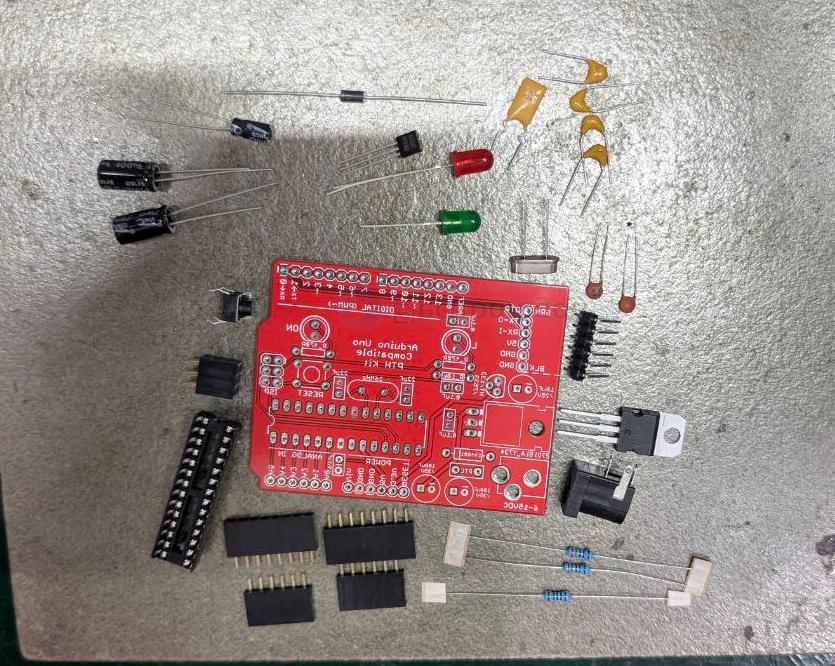

# DAR1033-dat

https://www.electrodragon.com/product/arduino-compatible-pth-kit/

## BOM

| Parts                     | category   |                   | qty | name | obselete version |
| ------------------------- | ---------- | ----------------- | --- | ---- | ---------------- |
| 6P 90-degree male header  | in Headers |                   |     |      |                  |
| 8P female header          | in Headers |                   | 2x  |      |                  |
| 6P female header          | in Headers |                   | 2x  |      |                  |
| 2*3 ISP male header       | in Headers |                   |     |      |                  |
| DC barrel power connector | in Headers |                   |     |      |                  |
| 28P IC socket             | in Headers |                   |     |      |                  |
| 0.1UF                     | RCL        | [[capacitor-dat]] | 4x  |      |                  |
| 22pf                      | RCL        | [[capacitor-dat]] | 2x  |      |                  |
| 10UF/25V                  | RCL        | [[capacitor-dat]] |     |      |                  |
| 100UF/35V                 | RCL        | [[capacitor-dat]] | 2x  |      |                  |
| 470R                      | RCL        | [[resistor-dat]]  | 2x  |      | 330Ohm           |
| 10K                       | RCL        | [[resistor-dat]]  | 1x  |      |                  |
| 16Mhz                     | other      |                   |     |      |                  |
| 5MM LED RED               | other      |                   |     |      |                  |
| 5MM LED GREEN             | other      |                   |     |      |                  |
| Reset Button              | other      |                   |     |      |                  |
| HT7333                    | other      | [[LDO-dat]]       |     |      | MCP1700 3.3V     |
| LM7805                    | other      | [[LDO-dat]]       |     |      |                  |
| PTC                       | other      | [[fuse-dat]]      |     |      |                  |
| 1N4001                    | other      | [[diode-dat]]     |     |      |                  |

* please order this alone: ATMega328 with Optiboot bootloader

## Demo 

- https://t.me/electrodragon3/208

## ref

- [[DAR1033]]
