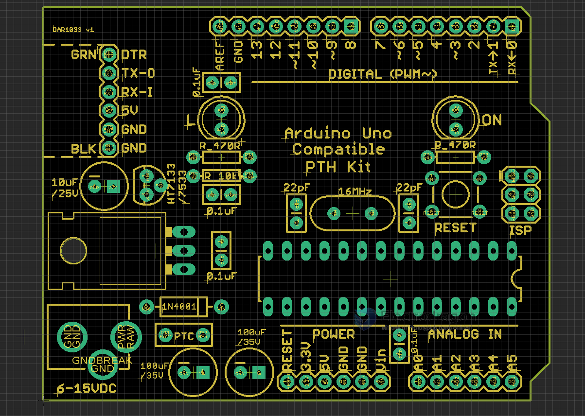

# DAR1033-dat

## BOM

| Parts                     | category   | qty | name |
| ------------------------- | ---------- | --- | ---- |
| 6P 90-degree male header  | in Headers |     |      |
| 8P female header          | in Headers | 2x  |      |
| 6P female header          | in Headers | 2x  |      |
| 2\*3 ISP male header      | in Headers |     |      |
| DC barrel power connector | in Headers |     |      |
| 28P IC socket             | in Headers |     |      |
| 0.1UF                     | RCL        | 4x  |      |
| 22pf                      | RCL        | 2x  |      |
| 10UF/25V                  | RCL        |     |      |
| 100UF/35V                 | RCL        | 2x  |      |
| 470R                      | RCL        | 2x  |      |
| 10K                       | RCL        |     |      |
| 16Mhz                     | other      |     |      |
| 5MM LED RED               | other      |     |      |
| 5MM LED GREEN             | other      |     |      |
| Reset Button              | other      |     |      |
| HT7333                    | other      |     |      |
| LM7805                    | other      |     |      |
| PTC                       | other      |     |      |
| 1N4001                    | other      |     |      |

## ref

- [[DAR1033]]
