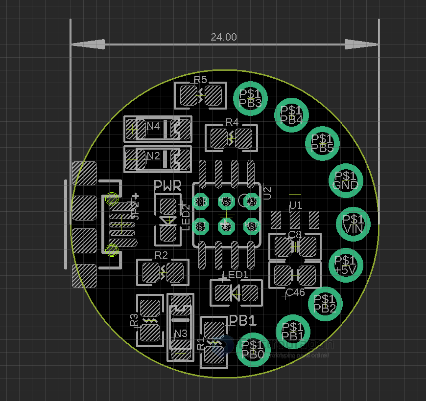

# DAR1047-dat

- https://www.electrodragon.com/product/attiny85-mini-dev-board-lilytiny-digispark-edatiny/

## Use guide 

Demo Guide
1. check the use guide video here: https://www.youtube.com/shorts/ePX9KjBYBIk
2. GIF video here. [[Edatiny.gif]]

Steps:
- install driver here [[Digistump.Drivers.zip]]
- install the board: http://digistump.com/package_digistump_index.json
  - Copy following into preference -> http://digistump.com/package_digistump_index.json
  - Install digi spark from board management.
  - More reference guide could see here https://digistump.com/wiki/digispark/tutorials/connecting

### Upload demo sketch (Default sketch)
* Use arduino example sketch, change buildinLED to 1 for EDAtiny
* ONLY plug in USB cable when starting to upload sketch

## ref 

- Compatible with Digispark lilytiny, etc board, can use open source project [micronucleus](https://github.com/micronucleus/micronucleus)
- https://www.electrodragon.com/w/EDAtiny

## debug 

* During upload sketch in you encounter any error, update the board driver to lisusb-win32 by [[AVR-dat]]

* Blink - On board test LED is D1, please try pinMode(1, OUTPUT);

## Note 

* The board won't be regonized BUT it is OK. No problem for uploading sketch

## For developer only

### Burning bootloader

Firmware - https://github.com/micronucleus/micronucleus/releases

* Use firmware - > release -> attiny85 aggressive.hex

* Our board already burned bootloader, use this only when things corrupted.
* Git clone bootloader project from here: https://github.com/Edragon/micronucleus, or download it from here [[File:Micronucleus-2.01.zip]] - [File:Micronucleus-2.01.zip](download it from here)

#### fuse setup
* High fuse DD
* Low fuse E1
* extend fuse FE. 