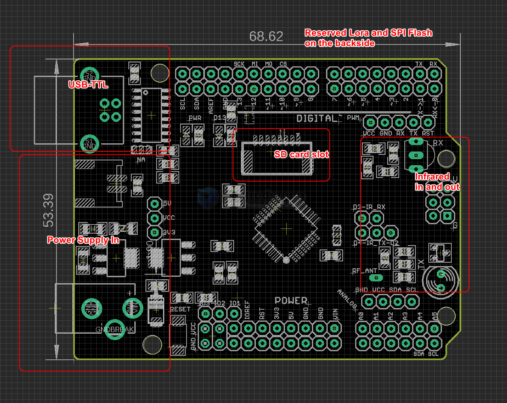

# DAR1050-dat

## Board map 

## Extra Functionnalities 

- PH2.0
- MicroSD card reader Slot 
- Infrared Transmitter and Receiver 
- Reserved place for the SPI Flash 
- Reserved place for the Lora Module 