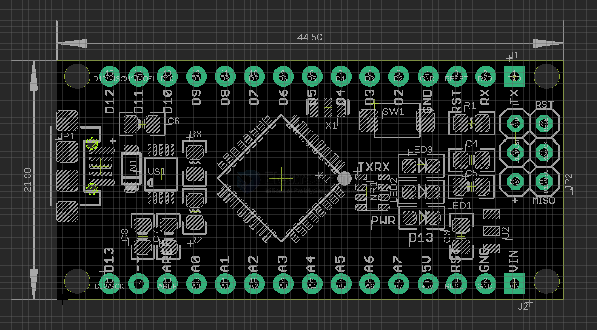
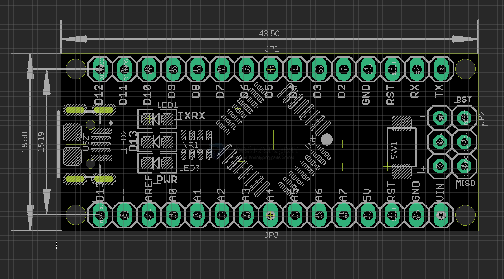

# DAR1053 DAT EDarduino Nano Dev. Board, Arduino Compatible

## Pin map 

version V4 

version V5 

## Note 

The version of this board is slightly bigger than normal arduino nano board on mechanical size, so NOT compatible physically.

Programming: Select the same “arduino nano” board in arduino IDE, and detected ch340 COM port to use.

## ref 

16M crystal 
- [[atmega328-DAT]]

- [[DAR1053]]