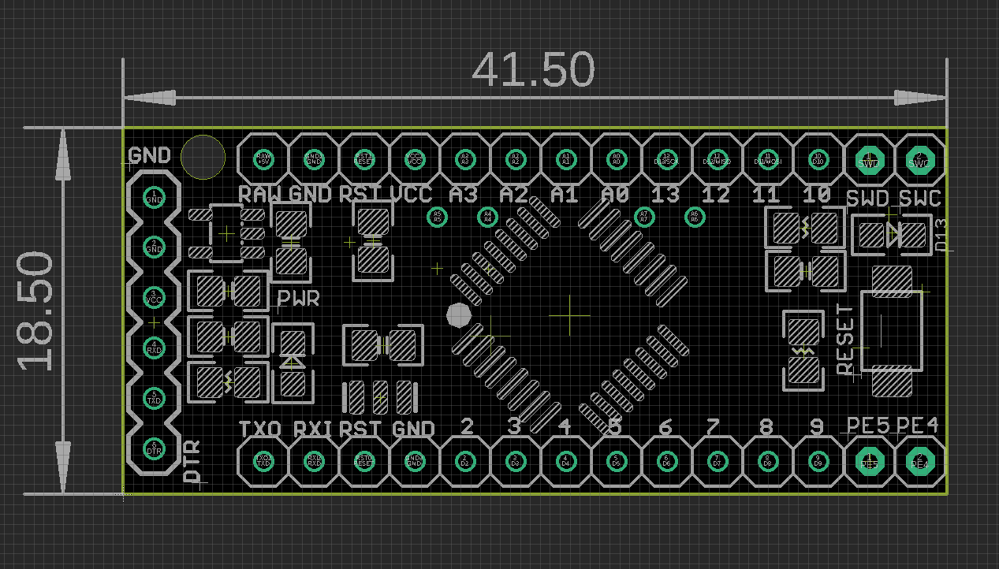
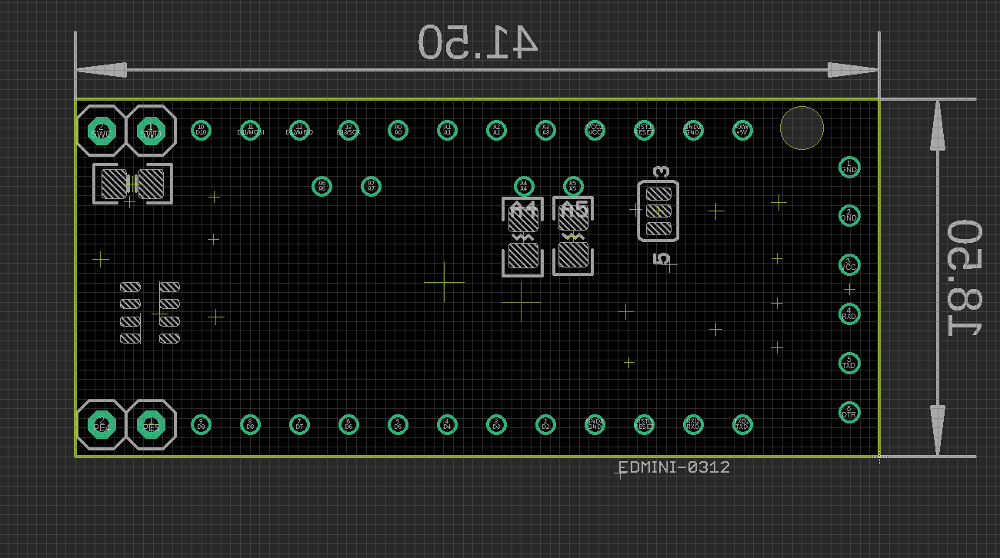

# DAR1056 DAT

### backside jumper setup

please refer to the image below 
- top-left capacitor for genesis arduino 
- network resistor for genesis arduino 
- pullup resistors in the middle for I2C
- power supply selector by 3-way SMD jumper 

## Note:
- Crystal no placed default, the MCU can use internal clock for most cases.
- Default power selection by 3-way jumper on board, default on 5V.

- Will build next version TQFP-48 footprint IC, nearly same cost but more functions.

## ref 

- [[LGT8F328-DAT]]

- [[serial-dat]]

- [[DAR1056]] - [[LGT8F328]]