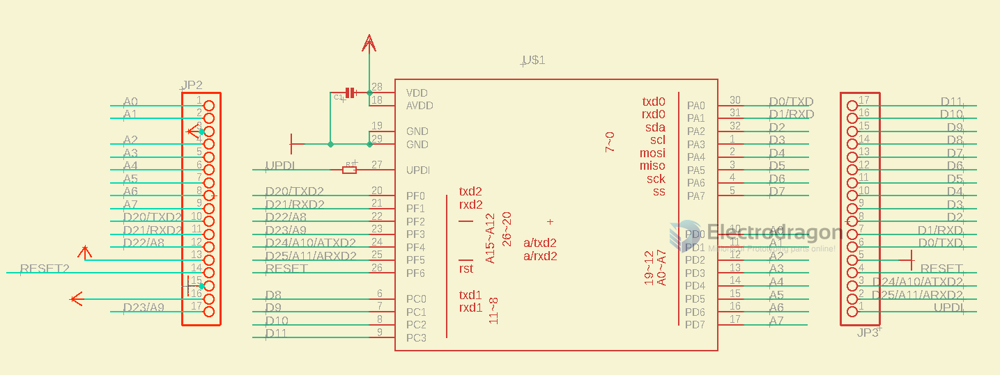
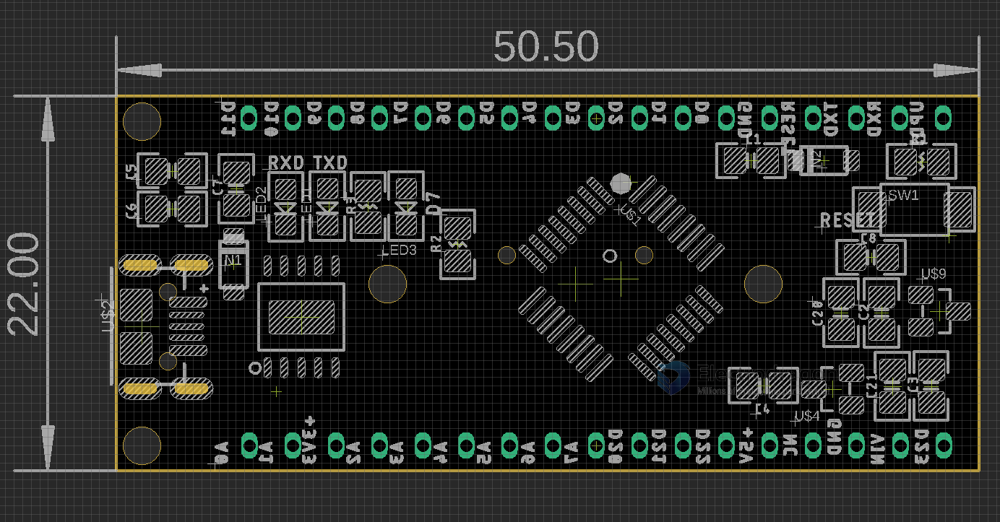
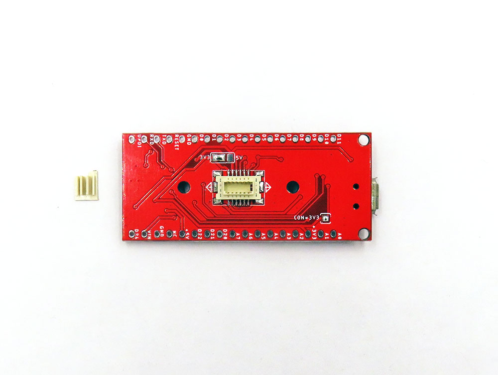
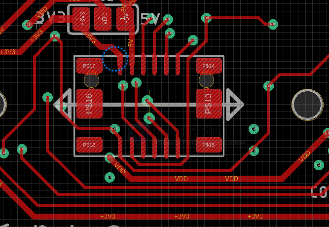
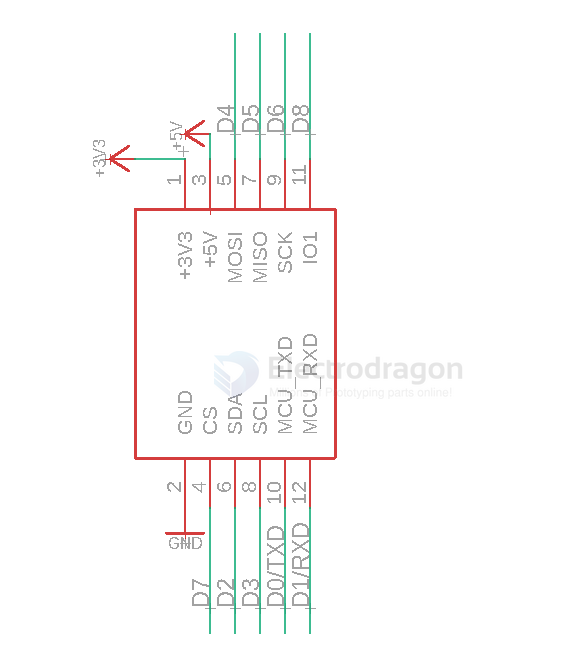

# DAR1060-dat 

## SCH 

## Hardware 

back CONN

## Programming 

- Programming Methods UPDI  [[UPDI-dat]], wiring = power supply + UPDI pin 

Serial port sketch uploading via USB

- arduino board file [[megaCoreX-dat]]
    - clock - internal 16MHz
    - BOD - BOD 2.6V
    - EEPROM retained
    - pinout - 32pin standard
    - reset pin - reset
    - bootloader - Optiboot UART2 alternative pins
    - programmer JTAG2UPDI

## BTB 

## ref 

- [[atmega4808-dat]]

- [[DAR1060]] 

- [[megaCoreX-dat]] - [[tinyAVR-dat]]

- [[BTB-dat]] / base