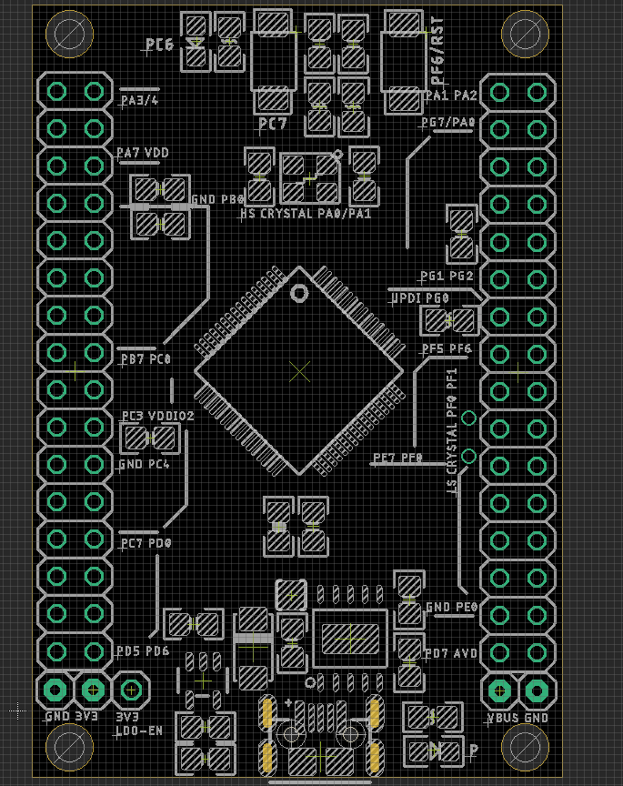
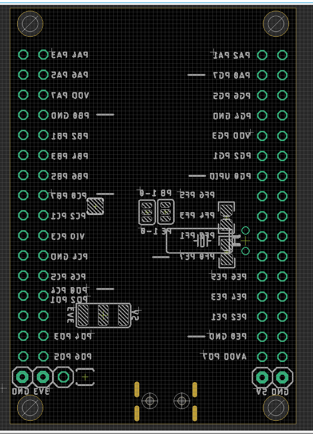

# DAR1064 

## hardware 

Jumper Setup 

| Power Supply 
Power Supply 
- normally 5V

Power Supply VDDIO2 
- to VDD

UART Selector 
- PB0 PB1 (USART 3)
- PE0 PE1 ()

## Usage 

- Install Driver for [[CH340-DAT]], check CH340K
- Power LED indicator should be light up

## ref 
- https://w.electrodragon.com/w/Category:AVR128#AVR128_Board

- [[UPDI-DAT]] - [[CH340-DAT]] - [[CH341-DAT]]

- [[DAR1064]] 

## Debug 

- Please check if backside jumpers are all soldered or not, power LED is NO or not.
- The full schematic is for purchased customers only, you can also view it directly here. 
- Default firmware should be hold down PC7 button and PC6 LED light up, or simple blink sketch. You can find all sketches in our [[arduino-IDE-DAT]]
- [More information please find at page here.](https://w2.electrodragon.com/Board/DAR/DAR1064-DAT/DAR1064-DAT.md)