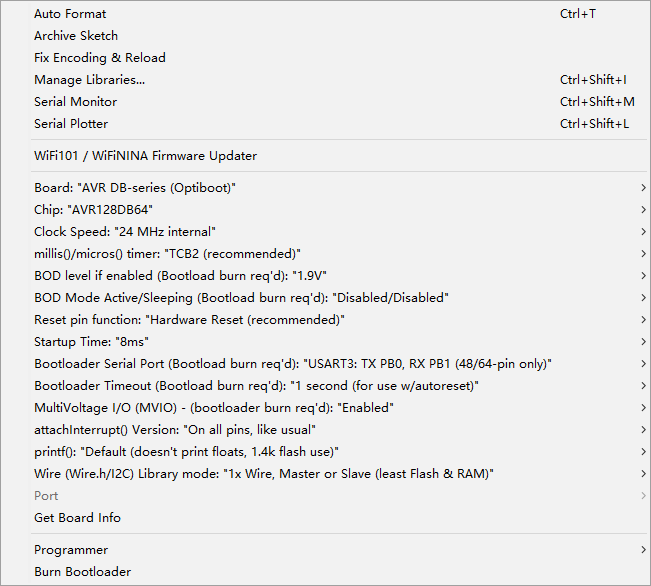

# DAR1064 

[AVR128DB64 Mini Develpment Board AVR128](https://www.electrodragon.com/product/avr128db64-mini-develpment-board-avr128/)

- [[avr128-dat]]

[legacy wiki page. ](https://w.electrodragon.com/w/Category:AVR128#AVR128_Board)

## hardware 

| On board resources | Pin | arduino setup |
| ------------------ | --- | ------------- |
| prog led           | PC6 | D22           |
| prog button        | PC7 | D23           |
| Reset              | PF6 | reset         |

### Jumper Setup 

| Options                 | Selections                             | Default           |
| ----------------------- | -------------------------------------- | ----------------- |
| Power Supply            | 5V or 3V3                              | 5V                |
| Power Supply of Vdd_io2 | to Vdd                                 | to Vdd            |
| USART of Programming    | PB0 PB1 (USART 3) or PE0 PE1 (USART 4) | PB0 PB1 (USART 3) |

## Usage 

- Install Driver for [[CH340-DAT]], check CH340K
- Power LED indicator should be light up

## bootloader settings 

- Clock -24 mhz internal 
- Bootloader serial port: PB0 / PB1
- Reset pin: default 

keep alll the unused options as default 
- Board: "AVR DB-series (Optiboot)"
- Chip: "AVR128DB64"
- Clock Speed: *24 MHz internal"
- millis0/micros0) timer: "TCB2 (recommended)*
- BOD level if enabled (Bootload burn req'd): "1.9V"
- BOD Mode Active/Sleeping (Bootload burn req'd): *Disabled/Disabled"
- WDT Timeout (Bootload burn req'd): “Disabled (recommended)
- WDT "window" (Bootload burn req'd): *No delay before window "opens""
- Reset pin function (Bootload burn req'd): *PF6: Reset (default boot entry on reset pin & SW r."
- Startup Time: "8ms"
- Bootloader Serial Port (Bootload burn req'd): *USART3: TX PB0, RX PB1 (48/64-pin only)
- Bootloader Entry Condition (Bootload burn req'd): “Default (see documentation)"
- MultiVoltage I/O (MViO) (Bootload burn req'd): “Enabled (burn bootloader req'd)*
- attachlnterrupt0 Version: *On all pins, with new implementation."
- printfO: "Default (doesn't print floats, 1.4k flash use)"
- Wire (Wire.h/I2C) Library mode: *1x Wire, Master or Slave (least Flash & RAM)*
- How to set FLMAP: "Use last FLMAP section, lock FLMAP, provide PROGME.."
- Port
- Get Board Info

## Crystal Setup 

- please notice all crystal are not populated, normally use the internal clock is enough
- PF0 / PF1 low speed RTC clock, PTH footprint 
- PA0 / PA1 high speed clock , SMD footprint 
- [[crystal-dat]]

## Debug 

- Please check if backside jumpers are all soldered or not, power LED is NO or not.
- The full schematic is for purchased customers only, you can also view it directly here. 
- Default firmware should be hold down PC7 button and PC6 LED light up, or simple blink sketch. You can find all sketches in our [[arduino-IDE-DAT]]
- [More information please find at page here.](https://w2.electrodragon.com/Board/DAR/DAR1064-DAT/DAR1064-DAT.md)

## demo video 

- [A quick start guide video please see here. Easy to use with Atmel-ICE or other UPDI programming methods.](https://www.youtube.com/watch?v=IgVMIRHFTLs)

- demo code == [arduino2](https://github.com/Edragon/arduino-main2)

## ref 
- https://w.electrodragon.com/w/Category:AVR128#AVR128_Board

- [[UPDI-DAT]] - [[atmel-ice-dat]] - [[CH340-DAT]] - [[CH341-DAT]] - [[avr128-dat]]

- [[arduino-dat]]

- [[DAR1064]] 

