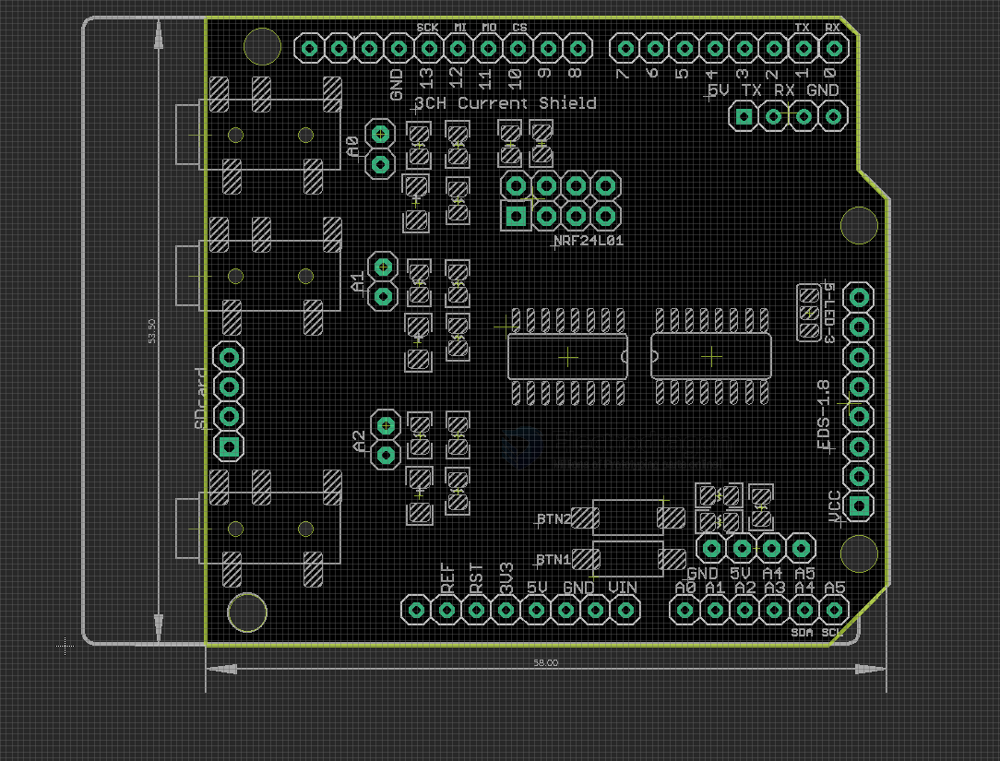

# DAS1010-dat

## Info

[product url - Arduino Energy Monitoring Shield V3](https://www.electrodragon.com/product/arduino-energy-monitoring-shield-v2/)

[this type of non-invasive AC current sensor](https://www.electrodragon.com/product/yhdc-non-invasive-ac-current-sensor-100a30a/)

- [[current-transformer-dat]] - [[YHDC-dat]]

### Board Map, Dimension, Pins, chip info, etc.

#### Board Map V3 2025 

#### Setup 

- To use 100A STC-013-000, put jumper on for the burder resistor on the board. Otherwise, use 30A or 50A STC-013-030 or STC-013-050, no jumper needed.

#### Functions 

- [[Nokia-5110-dat]] - [[button-dat]]

- [[ILC0003-dat]] - [[nrf24l01-dat]]

## Applications, category, tags, etc. 

## Demo Code and Video

- [github.com/openenergymonitor/EmonLib](https://github.com/openenergymonitor/EmonLib/tree/master/examples/current_only)

## ref 

- [[AC-mains-dat]]

- [[DAS1010]] 

- [legacy wiki page ](https://www.electrodragon.com/w/Enery_Monitoring_Shield)

