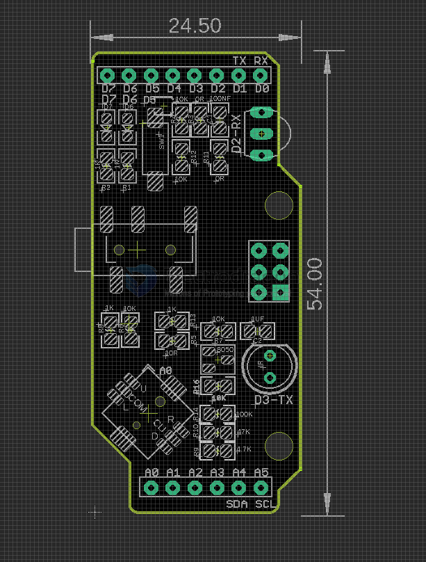

# DAS1013-dat

legacy wiki page - https://w.electrodragon.com/w/Arduino_IR_Infrared_shield

- demo send video - [[das1013_Infrared_send_demo.gif]]

- board - https://www.electrodragon.com/product/arduino-ir-infrared-shield/

## board map 

- AUX Jack support extra longer IR detector if you have 

## Arduino pin definitions 

| function                        | arduino pin                                        |
| ------------------------------- | -------------------------------------------------- |
| Two programmer LED              | D6 D7                                              |
| One programmer button           | D5                                                 |
| Analog 5-directional joystick   | on A0, press down first and then control direction |
| Infrared transmitter LED on pin | D3                                                 |
| Infrared receiver LED on pin    | D2                                                 |

## demo code 

- [IRremote](https://github.com/z3t0/Arduino-IRremote)

## ref 

- [[DAS1013]]

- [[infrared]] - [[infrared-dat]]