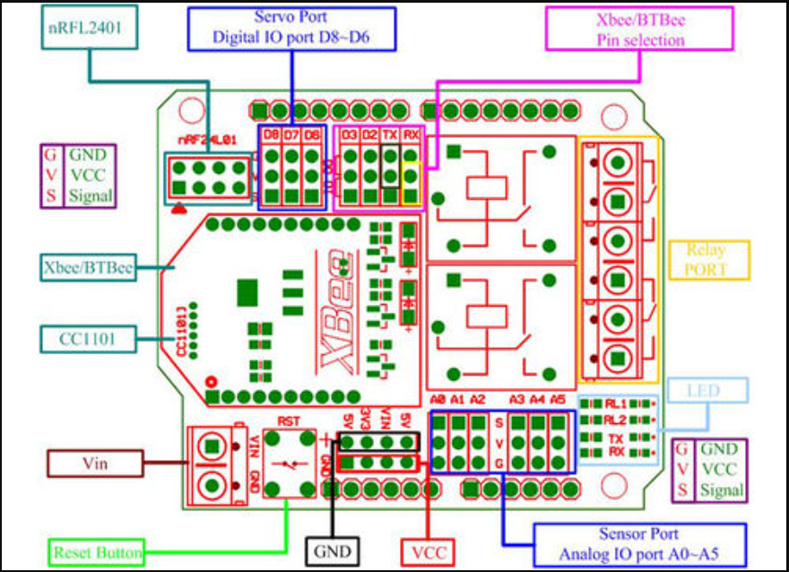
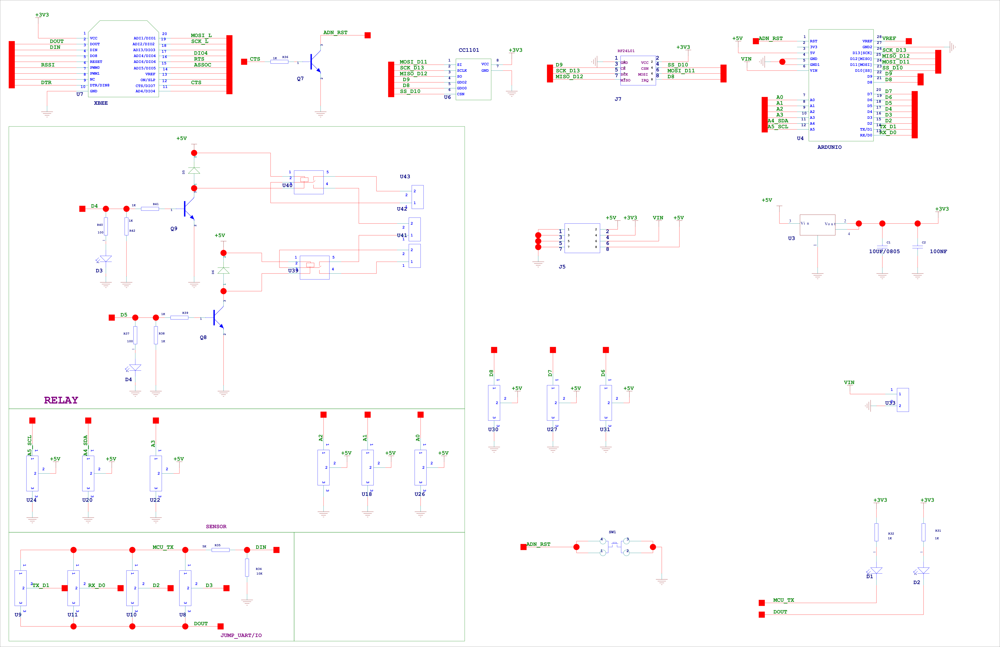

# DAS1016-dat.md

## Info

[product url - Wireless NRF24 Controlled Relays Arduino Shield](https://www.electrodragon.com/product/arduino-2-channels-relay-extension-shield-wireless-supported-btbeexbee-nrf24l01/)


### Board Map, Dimension, Pins, chip info, Use Guide, Setup Jumper, etc.



- [[relay-dat]]

SCH 



## Applications, category, tags, etc. 


## Demo Code and Video


The demo code is test the module RF, BTBee and Relay part. And the code base on the [[NRF24L01-dat]], you need change the pin define as below. If you test the Bluetooth Bee interface, you need used other Bluetooth device paired with BTBee. 

Here we used a Android phone with our [[bluetooth-dat]] as client to paired with BTbee(HC-o6).


```cpp
#include "API.h"

//---------------------------------------------
#define TX_ADR_WIDTH    5   
// 5 unsigned chars TX(RX) address width
#define TX_PLOAD_WIDTH  1  
// 20 unsigned chars TX payload
//---------------------------------------------
#define CE       9
// CE_BIT:   Digital Input     Chip Enable Activates RX or TX mode
#define CSN      10
// CSN BIT:  Digital Input     SPI Chip Select
#define SCK      13
// SCK BIT:  Digital Input     SPI Clock
#define MOSI     11
// MOSI BIT: Digital Input     SPI Slave Data Input
#define MISO     12
// MISO BIT: Digital Output    SPI Slave Data Output, with tri-state option
#define IRQ      8
// IRQ BIT:  Digital Output    Maskable interrupt pin
//*********************************************
#endif
```


## ref 

- [[DAS1016]] 

- [legacy wiki page ](https://w.electrodragon.com/w/2_Channels_Relay_Extension_Shield_(Wireless_%26_Arduino_Supported))
