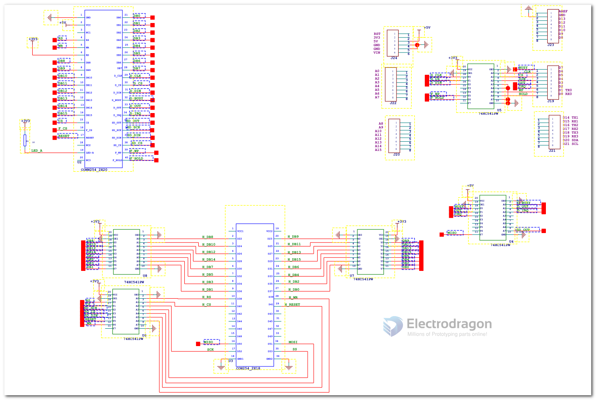

# DAS1030-dat 

- [the legacy wiki page](https://w.electrodragon.com/w/EDL_LCD_HDK#Schematic)

- [[DAS1030-dat]] arduino MEGA version for larger size LCD
- [[DAS1031-dat]] arduino UNO version for smaller size LCD

https://www.electrodragon.com/product/3-2-tft-lcd-arduino-adapter-shield/

- [you will also need corresponding LCD here. ](https://www.electrodragon.com/product/tft01-lcd-tft-display-3-2-65kcolors-320240-resolution-touch-panel-sd-slot/)

## SCH

Version 2 

with [[buffer-dat]]

Version 1 

