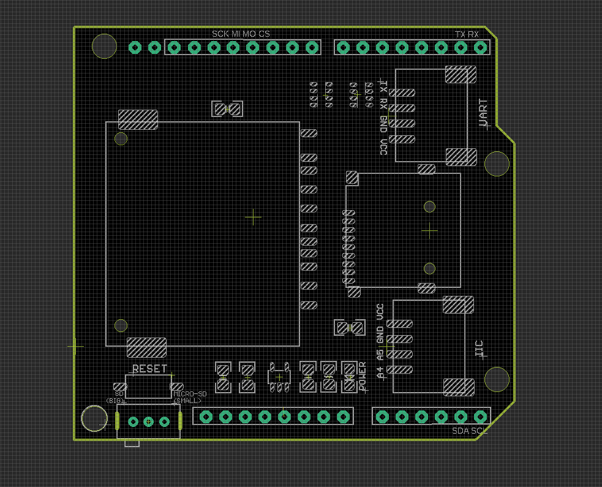

# DAS1033 DAT Arduino Memory TF SD MicroSD Shield

## Setup
Set up the swtich to the Card Slot you want
- left side for left side big SD card Slot
- right side for micro SD card slot 

## Usage:
- For default arduino official SD library, only need to change CS pin to 10. NOT default D4 in sketch.
- Notice switch to “big” or “Micro” for either SD card or microSD card.
- Supported by default Arduino IDE SD library.
- See the manual documents, library available on this page.

## ref 
- https://w.electrodragon.com/w/Arduino_Stackable_SD_Card_Shield