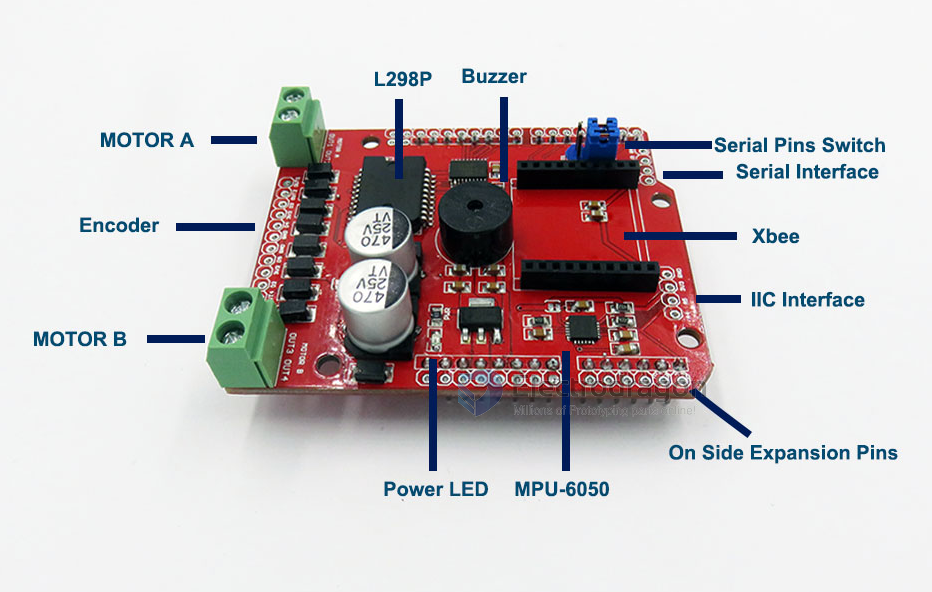
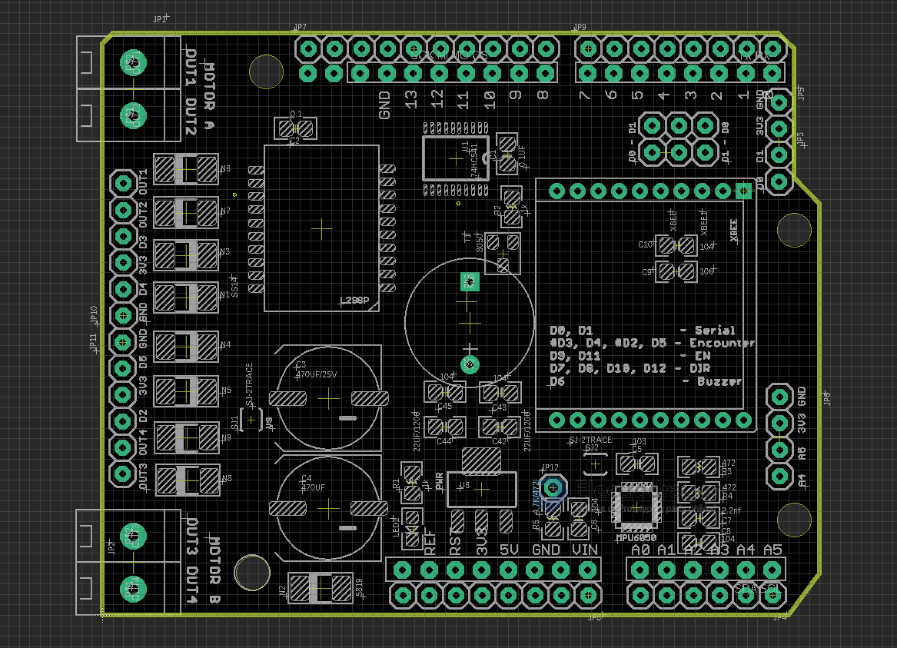

# DAS1043 DAT

- [[L298-dat]] - [[buzzer-dat]]

- [[MPU6050-dat]]

- legacy wiki page L298N - https://w.electrodragon.com/w/Category:L298#Download

## Pin Definitions 

Misc 
- D6: On board Buzzer

LAN298N Motor driver 

- D9, D11          - EN
- D7, D8, D10, D12 - DIR

External limiter 

- D3, D4, #D2, D5: Pin Connector 

Sensor [[I2C-dat]]

- [[MPU6050-DAT]] - [[sensor-motion-dat]]

[[Xbee-dat]]

- Serial output to Arduino D0, D1 (jumpers)

## Tuto 

- https://www.instructables.com/Making-a-Mini-Self-balancing-Car-in-Two-Steps/

## ref 
- [[DAS1043]]

