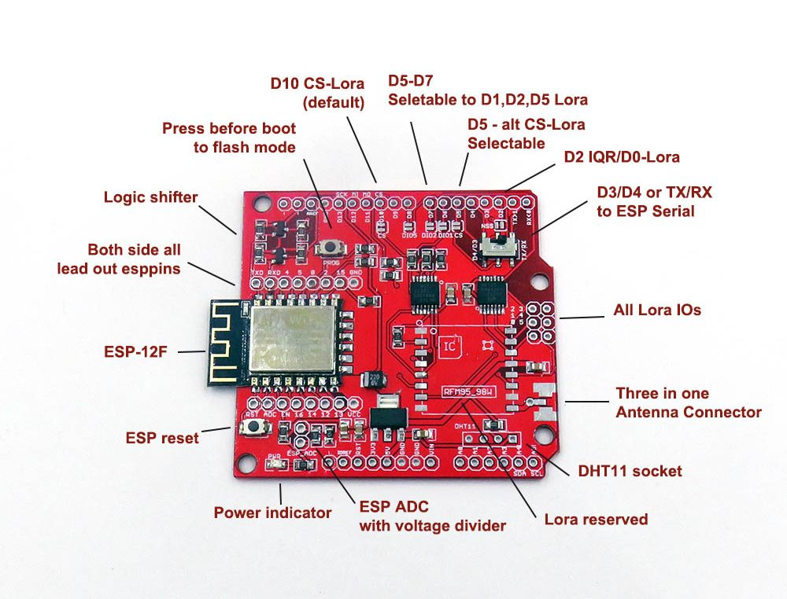
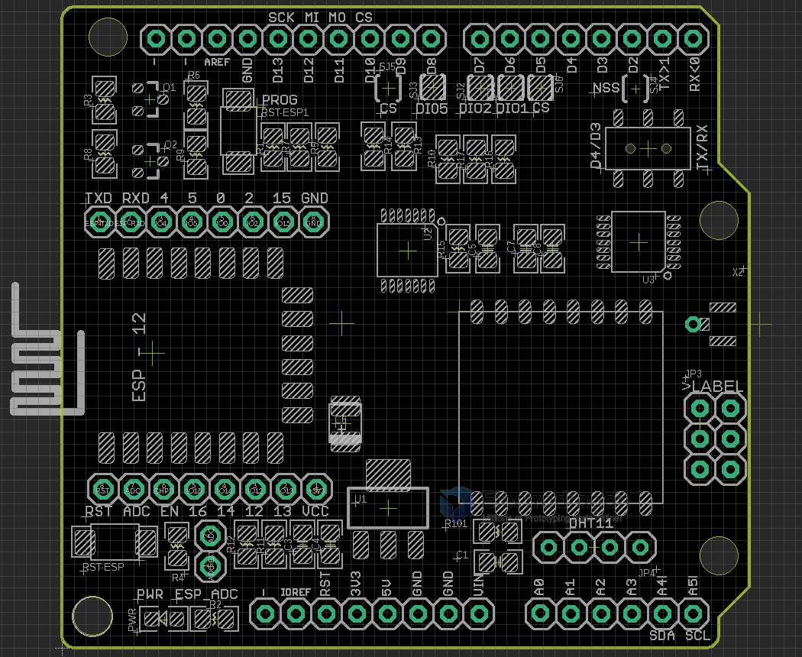
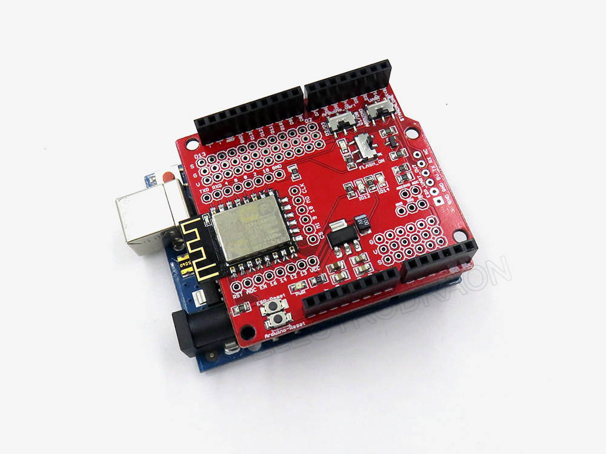
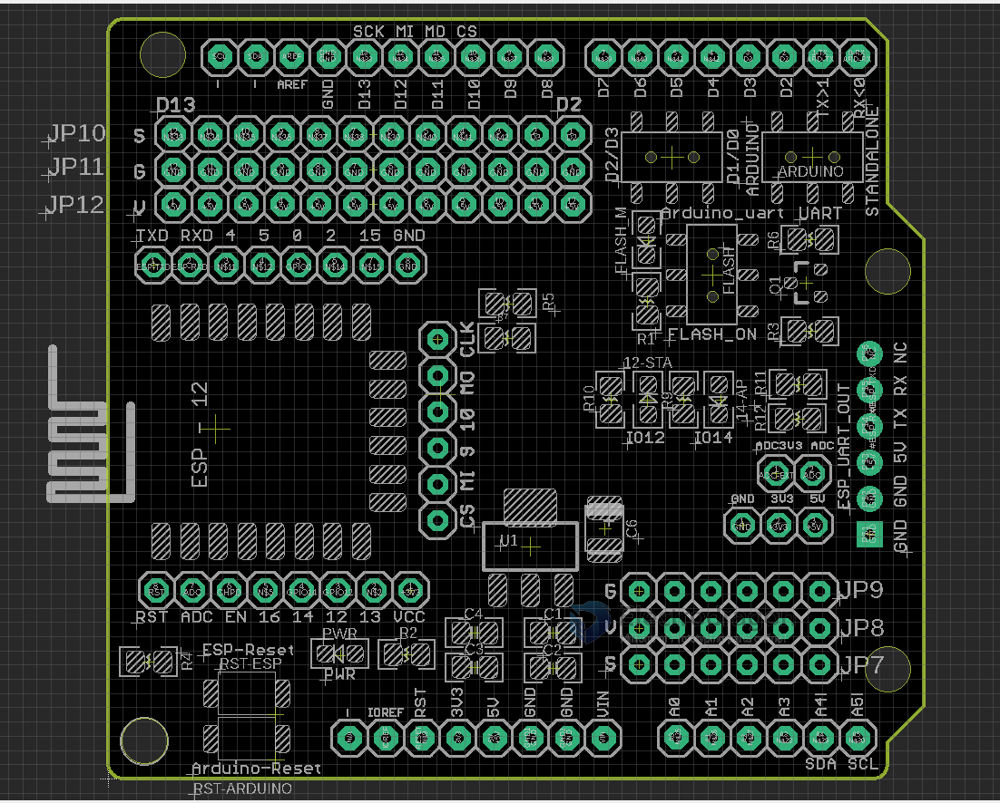

# DAS1069-dat

link - https://www.electrodragon.com/product/esp8266-wifi-arduino-uart-extension-board/

## Current Version 2

### Configuration

| Jumper Name  | target  | Set            | Description                                                 |
| ------------ | ------- | -------------- | ----------------------------------------------------------- |
| Flash Button | ESP8266 | ON or OFF      | Set ESP8266 to flash mode, flash LED will turn on           |
| Switch1      | arduino | D1/D0 or D3/D4 | Arduino serial switch between softserial or hardware serial |
| Reset Button | ESP8266 |                | Reset                                                       |

## Function lists 

| Functions         | Status   | Note         |
| ----------------- | -------- | ------------ |
| [[ESP-12F-dat]]   | Included |              |
| [[NWL1071-dat]]   | reserved | [[Lora-dat]] |
| [[RFM95-dat]]     | reserved | [[Lora-dat]] |
| [[DHT11-dat]]     | reserved |              |
| [[spi-flash-dat]] | reserved |              |
| [[74HC125-dat]]   | Included |              |

## Lora SPI Part

| arduino | Note        | customize        | Note2.          |
| ------- | ----------- | ---------------- | --------------- |
| 13      |             | lora_CLK         | SPI             |
| 12      |             | lora_DO          | SPI             |
| 11      |             | lora_DI          | SPI             |
| 10      |             | lora_CS          | SPI_CS1         |
| 9       |             | lora_Reset       |                 |
| 8       | via. jumper | lora_DIO5        |                 |
| 7       | via. jumper | lora_DIO2        |                 |
| 6       | via. jumper | lora_DIO1        |                 |
| 5       |             | flash_CS         | SPI_CS2         |
| 4       | alternative | alt. ESP8266_TXD | software Serial |
| 3       | alternative | alt. ESP8266_RXD | software Serial |
| 2       | INT0        | lora_IRQ         |                 |
| 1       | TXD         | ESP8266_RXD      |                 |
| 0       | RXD         | ESP8266_TXD      |                 |

- D13 - CLK
- D12 - DO
- D11 - DI 
- D10 - CS
- DIO0 / IRQ - D2

Reserved DIO (via jumpers)
- DIO1 - D6
- DIO2 - D7
- DIO5 - D8
- DIO3 - x
- DIO4 - x 

## DHT11

- Selectable to ESP IO13 or Arduino A0, by backside jumper

## Demo code 

- arduino_uart_esp_at -> arduino send AT commands to ESP8266
- arduino_uart_esp_wifi -> "transparent" communicatino in TCP client mode 
- in https://github.com/Edragon/arduino-esp8266/tree/master/Sketchbook/Hardware

## old versions 

### Version 1

## ref

- [[arduino-dat]]