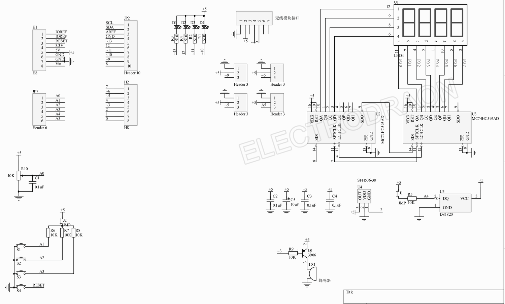

# DAS1075-dat

## Info

[product url - Arduino Sensor Interactive Wireless MISC Utility Shield](https://www.electrodragon.com/product/arduino-misc-basic-extension-shield/)

### Board Map, Dimension, Pins, chip info, Use Guide, Setup Jumper, etc.

| Function                                          | Pin        |
| ------------------------------------------------- | ---------- |
| Trim pot                                          | A0         |
| Buttons                                           | A1, A2, A3 |
| DS18B20, LM35                                     | A4         |
| IO (3-pin header, VCC GND IO)                     | A5         |
| Serial port (supports APC220, Bluetooth, etc)     | D1, D0     |
| Infrared receiver (SFH506)                        | D2         |
| Buzzer                                            | D3         |
| IO (3-pin header, VCC GND IO)                     | D5, D6, D9 |
| SDI, CLK, Latch → 2× 74HC595 (4× segment display) | D8, D7, D4 |
| LEDs                                              | D13–D10    |

## Applications, category, tags, etc. 

## Demo Code and Video

## ref 

- [[DAS1075]] 

- [legacy wiki page ](https://w.electrodragon.com/w/Arduino_MISC_Shield)

- broken link - https://github.com/Edragon/Arduino_sketch/tree/master/MISC%20board%20demo%20code

- demo code please find repos at [[arduino-dat]]

- [[shields-dat]] - [[arduino-shields-dat]] - [[RPI-shields-dat]]