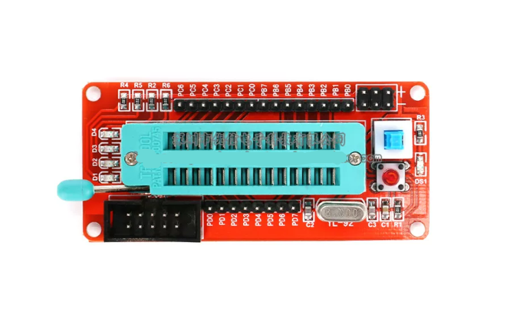
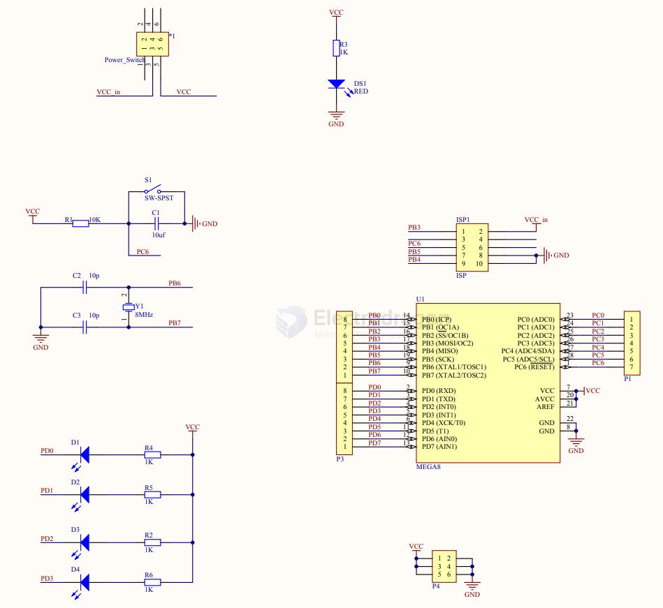

# DOD1012-dat

## Info

[product url - AVR Atmega8 168 328 Min. Development Board](https://www.electrodragon.com/product/avr-atmega8-168-328-min-development-board/)

- [[avr-dat]] - [[DOD1012-dat]] - [[atmega328-dat]] - [[DIP-dat]]

### Board Map, Dimension, Pins, chip info, Use Guide, Setup Jumper, etc.

- 1.23个10引脚全部引出。
- 2.经典ATmega8系统，省去焊接的麻烦
- 3.晶振：采用圆孔插座焊接方式，方便买家更换晶振，默认发8M晶振
- 4.支持芯片：ATmega8
- 5.供电方式：ISP下载器供电和外扩排针供电2选一
- 6.外扩3路VCC,GND,如图中排针所示
- 7.复位：上电复位和按键复位
- 8.外扩4路led灯，方便调试使用
- 9.电源指示灯(DS1)
- 10.标准ISP下载接口，使用本店本店51/avr下载器能够对系统程序实现方便下载（板子不需要单独供电，支持ISP下载接口供电)

SCH 

## Applications, category, tags, etc. 

## Demo Code and Video

## ref 

- [[DOD1012]] 

- [legacy wiki page](https://www.electrodragon.com/w/AVR_Atmega8_168_328_Min._Development_Board) - https://w.electrodragon.com/w/AVR_Dev_Board

