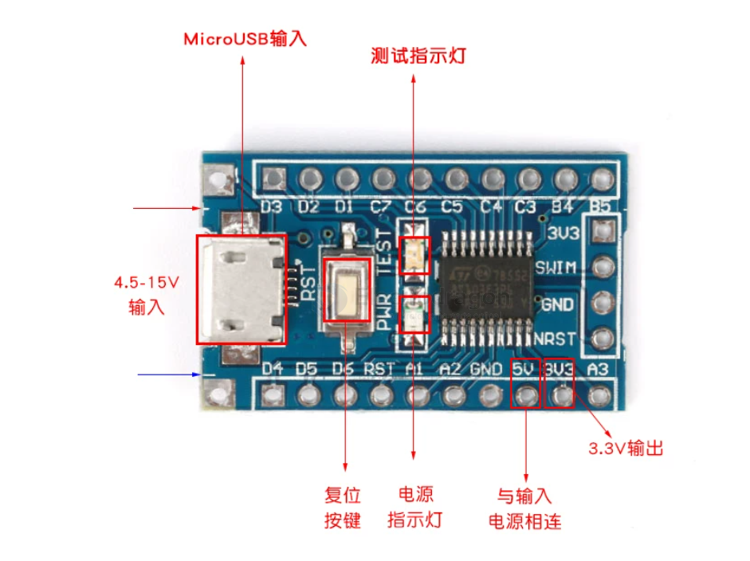
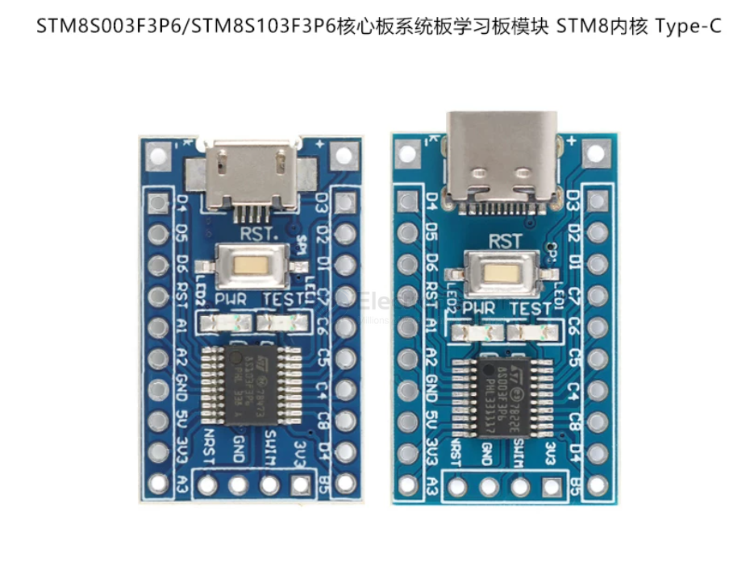

# DOD1014-dat

[STM8S103F3P6 Mini Dev Board](https://www.electrodragon.com/product/stm8sf103f3p6-mini-dev-board/)

- [[STM8-dat]]

## board map 

产品特性：
- 1.使用STM8S103F3P6为主控IC。
- 2.可以用板子上的2.54排针取电或是焊盘取电，使用焊盘取电时，输入电压范围在4.5V-15V，可同时通过排针向外部输出3.3V!
- 注意：5V排针与模块的输入电源相连。
- 3.引出所有引脚，引脚旁边标注出该引脚标号，带有复位按键，电源指灯，和程序演示指示灯，麻雀虽小五脏俱全。
- 4.支持SWIM调试方式。

## ref 

- [[DOD1014]]