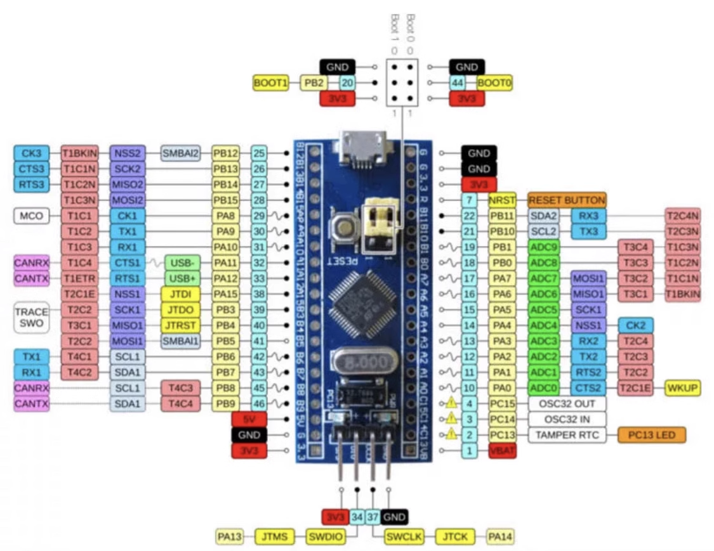
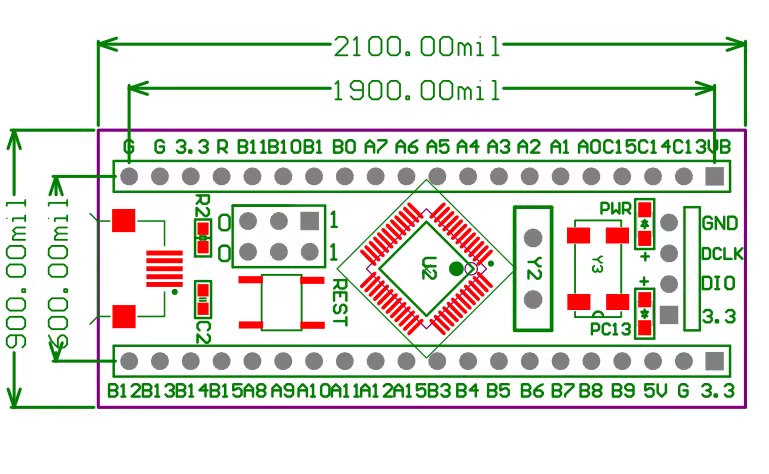
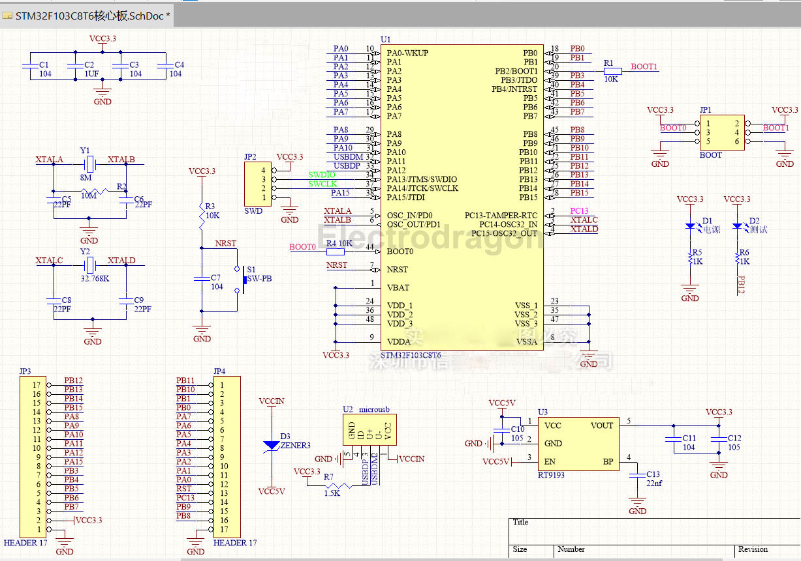

# DOD1046-dat

https://www.electrodragon.com/product/arm-stm32f103c8t6-mini-development-board-r2/

legacy wiki page - https://www.electrodragon.com/w/STM32_Dev_Board

- https://w.electrodragon.com/w/Category:STM_MCU

- [[STM32-dat]]

- STM32F103C6T6 
- only half memory of STM32F103C8T6 = 32KB
- the rest remain the same

## SCH 

## ref 

- also called as "black pill"

- more documentation can be found here - https://stm32-base.org/boards/STM32F103C8T6-Black-Pill.html

- [[STM32-dat]]

- [[DOD1046]]