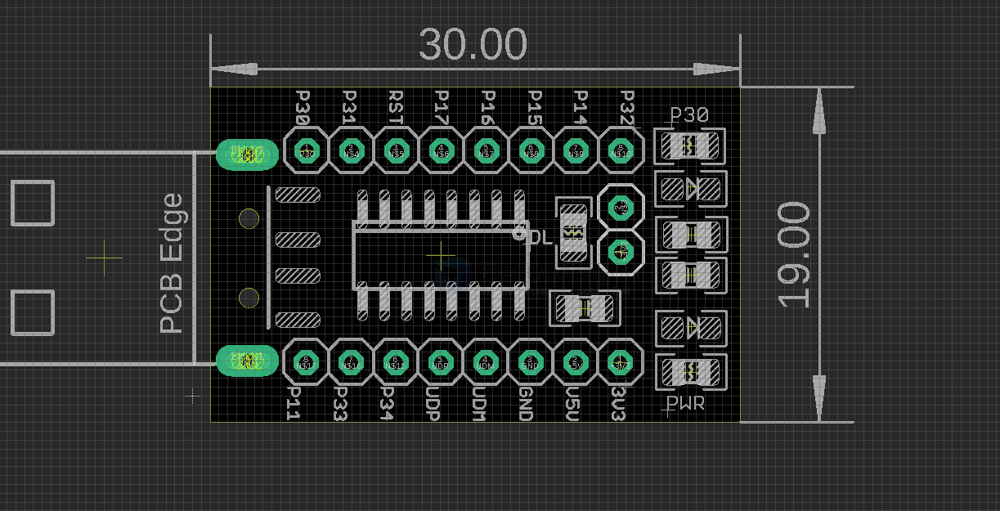

# DOD1064-dat

- [[CH55x-DAT]] - [[CH551-dat]] - [[CH552-dat]] - [[CH554-DAT]] - [[CH559-DAT]] - [[WCH-MCU-dat]]

## Info

[product url - CH551 Mini USB MCU DEV Board [CH55x Series]](https://www.electrodragon.com/product/ch551-mini-dev-board-ch55x-series/)

### Board Map, Dimension, Pins, chip info, Use Guide, Setup Jumper, etc.

hold the internal two pins to enter into programming mode 

## Applications, category, tags, etc. 

## Demo Code and Video

## ref 

- [[DOD1064]] 

- legacy wiki page 

