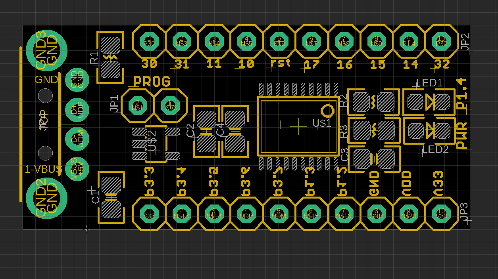
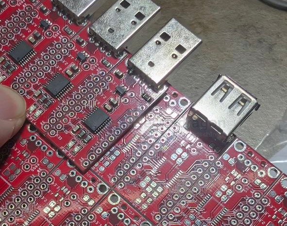
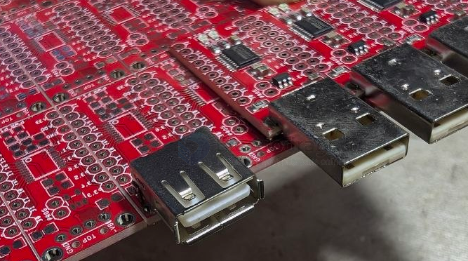

# DOD1068-DAT

- [[USB1000-dat]] - [[DOD1068-dat]] - [[SDR1113-dat]] - [[CH554-dat]] - [[CH55x-dat]]

- [[CONN-USB-A-dat]]

## board info 

- [[CH554-dat]] 

default voltage setup on the back side == 

on board LED P1.4, power supply 

- [[WCH-MCU-dat]]

## Board update 

refer pins at - [[CONN-USB-A-dat]]

V2 add [[USB-receptacle-dat]] and [[USB-plug-dat]] options, pin-to-pin compatible, both connector unsoldered, user can choose to solder either one of them.

V1 plug fixed solder version (left)

V2 unsoldered version 

## ref 

- [[CH55x-DAT]] - [[CH554-DAT]]