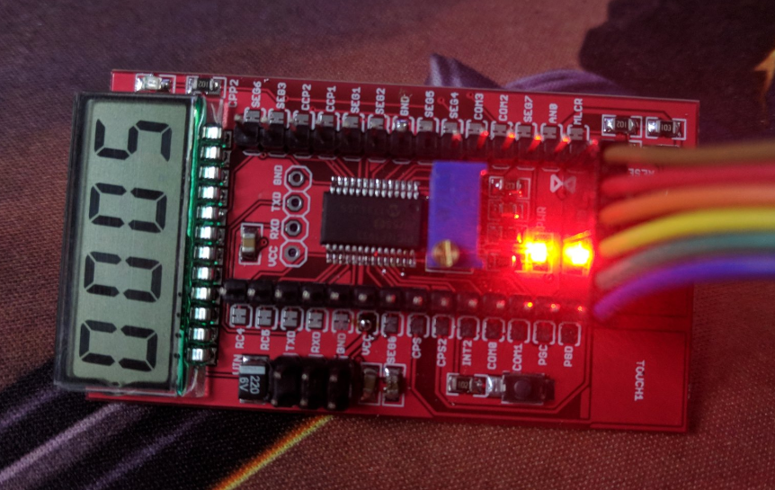

# DOD1074 DAT

- [[PIC16F1933-DAT]]

## Pin Definitions 

- touch pad CPS1 = RB1
- touch pad CPS2 = RB2
- ADC read pin = AN0 / RA0
- LED pin CPP2 = RC1
- Button = INT2 = RB2
- RC7 / RC6 = RXD / TXD

## Demo 

