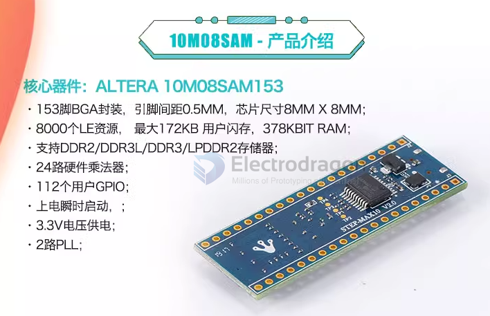
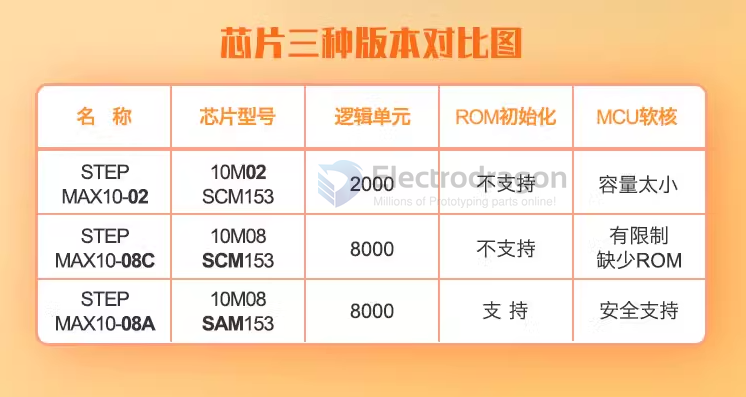

# DOD1081-dat

legacy wiki page - https://www.electrodragon.com/w/FPGA

## chip Versions

- 10M08SCM - MAX10 M08 SCM
- 10M02SCM
- 10M08SAM - MAX10 M08 SAM 153 - current

chip models note 
- 08SCM - 8K logic elements
- SC : Single supply - compact features
- M : Micro FineLine BGA (MBGA)
- 153: MBGA Package Type 153 : 153 pins, 8 mm x 8 mm
- C : Commercial (T = 0° C to 85° C)
- 8: FPGA Fabric Speed Grade
- G : RoHS6

## Info 

## Demo video 

- https://twitter.com/electro_phoenix/status/1005348639848452096

## ref 

- [[DOD1081]]
- http://www.stepfpga.org/step-max10-development-board/

