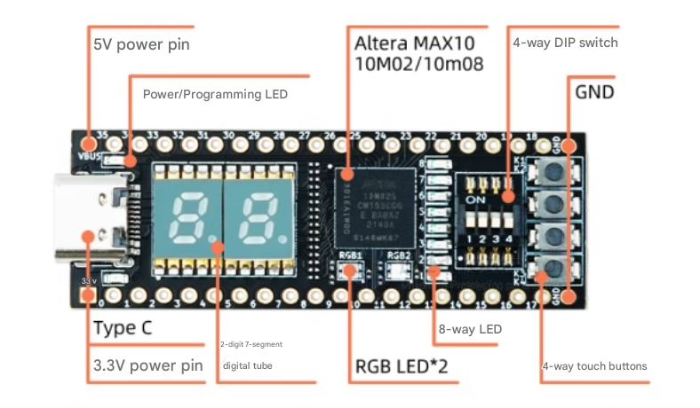

# DOD1081-dat

Currently selling is Altera MAX10 – MAX10M08SAM153C8G (not always the same, please select on option)

- [[MAX10-dat]] - [[Altera-dat]]

[legacy wiki page](https://www.electrodragon.com/w/FPGA)

## Info 

Core Chip -- MAX10M02/08
Logic Resources -- 2K /8KLEs
Maximum Operating Frequency -- 400MHz
Download Method -- Integrated JTAG Downloader

## Program and Power Supply by USB Type-C Cable 

## Demo video 

- https://twitter.com/electro_phoenix/status/1005348639848452096

## ref 

- [[jtag-dat]] - [[altera-dat]]
  
- [[DOD1081]]

