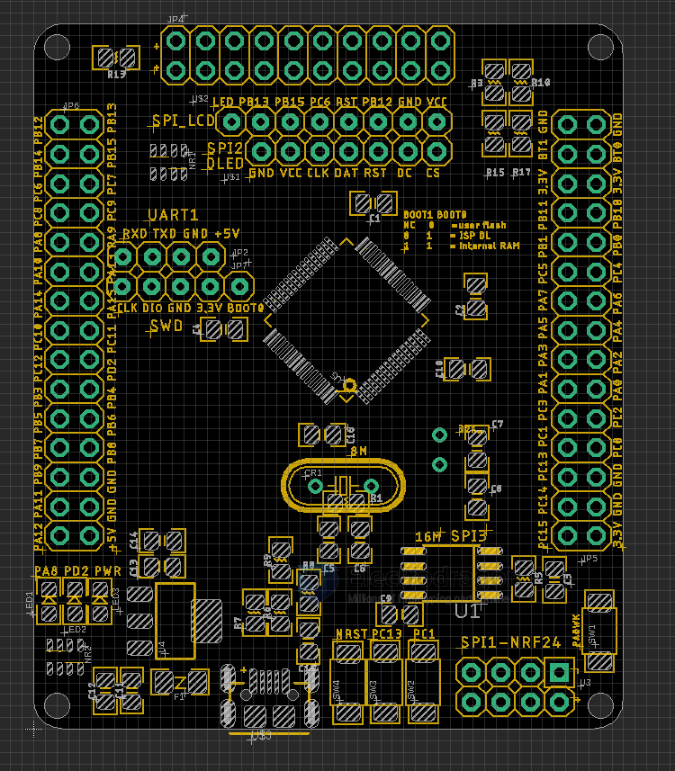

# DOD1084-dat

https://w.electrodragon.com/w/STM32

Input Buttons 
- PA0
- PC1
- PC13 

LED Indicators 
- PA8
- PD2
- Power LED

- [[STM32-dat]]

## Demo 

- Pre-loaded demo code, to simulate SPI Flash as USB stick, print debug info on screen, connect via USB to PC, read and write files. (need format), demo here.
- https://twitter.com/electro_phoenix/status/1032181134833008642

## ref 

- [[DOD1084]]