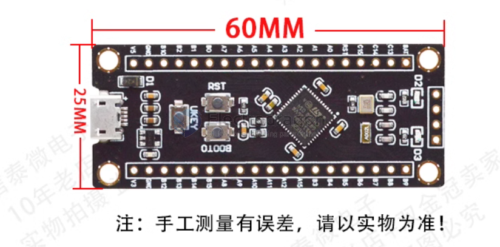

# DOD1096-dat

https://www.electrodragon.com/product/stm32f401-mini-dev-board-stm32f401ccu6/

legacy wiki page - https://w.electrodragon.com/w/Category:STM32#F4.2B

## Board map 

STM32F401 开发板
- Frequency up to 84 MHz
- Memories
    - Up to 256 Kbytes of Flash memory
    - 512 bytes of OTP memory
    - Up to 64 Kbytes of SRAM

STM32F411 开发板
- Frequency up to 100 MHz
    - Up to 512 Kbytes of Flash memory
    - 128 Kbytes of SRAM

## ref 

- [[DOD1096]]

- [[STM32F401-dat]] - [[stm32-dat]]