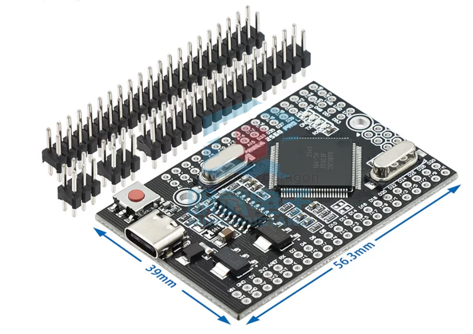
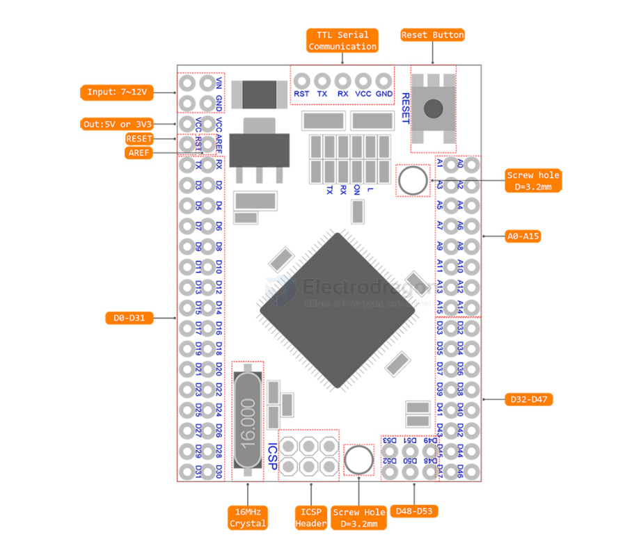
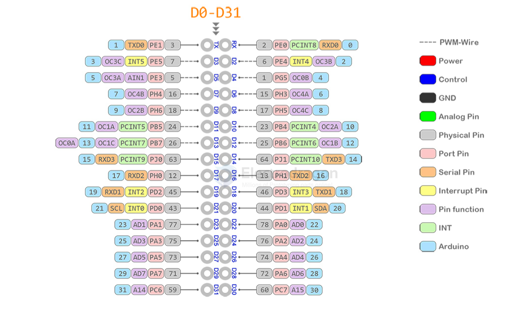
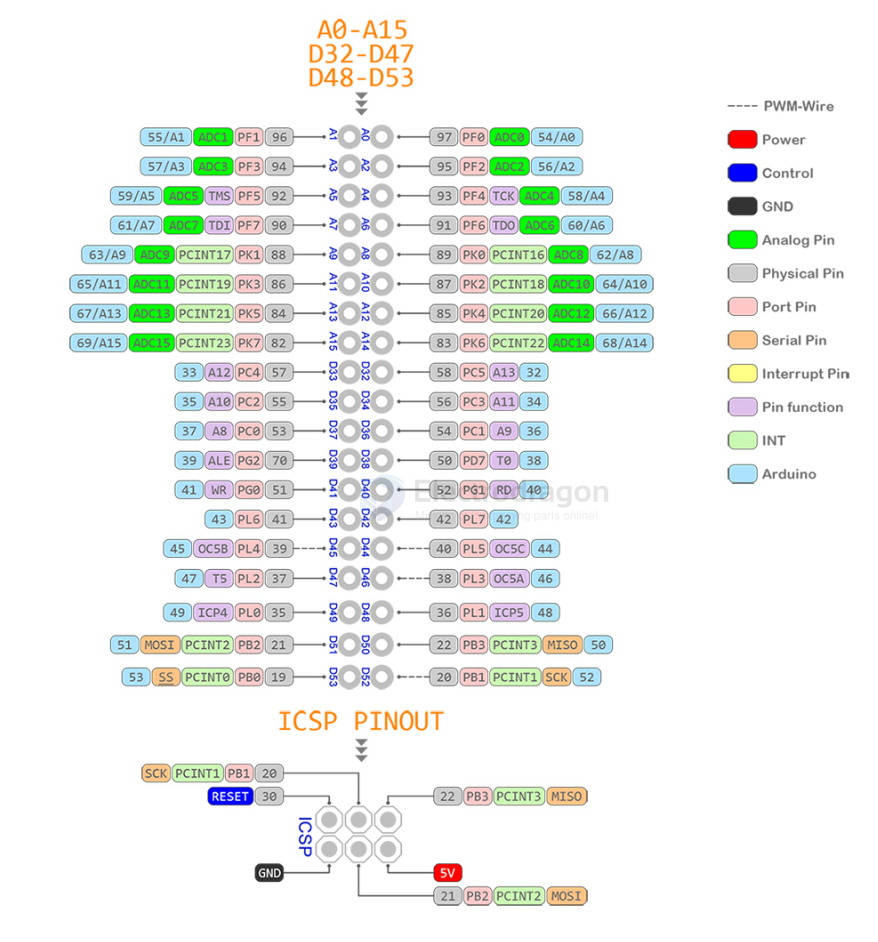
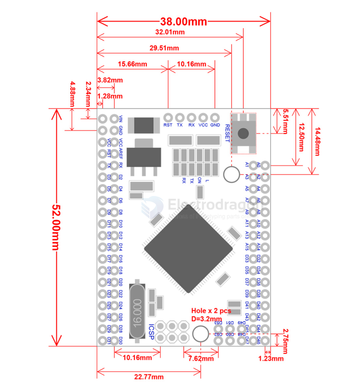

# DOD1100-dat

## Info

[product url - MEGA 2560 RPO ATmega2560-16AU Mini Board, USB CH340G](https://www.electrodragon.com/product/mega-2560-rpo-atmega2560-16au-mini-board-usb-ch340g/)

- [[atmega2560-dat]] - [[AVR-dat]] 

- [[CH340-dat]]

嵌入版Mega 2560 CH340G / ATmega2560 - 兼容 Mega 2560主板。基于Atmel ATmega2560微控制器和USB-UART接口芯片CH340G构建。

电路板尺寸紧凑，尺寸为38x55mm。这是一个很好的解决方案，使您的终项目在焊接原型板上。

主板功能类似于Arduino Mega 2560.它是嵌入式主板，但同样稳定，并采用原装芯片ATmega2560（16 MHz）。

该板使用芯片CH340G作为转换器UART-USB。当您在频率12Mhz工作时，提供稳定的数据交换结果（需要安装驱动程序到计算机）。

Mega PRO（嵌入式）2560 CH340G / ATmega2560 - 通过microUSB电缆连接到计算机（几乎适用于所有Android智能手机）。

您可以通过MicroUSB连接器为电路板供电或为插针供电。电压调节器（LDO）可以处理6V至9V（峰值18V）DC的输入电压。输出电流为5V - 约800mA，3.3V - 约800mA（请注意，输入电压越高，输出电流越低）。这将为您的大部分初始项目提供可靠的动力。

### Board Map, Dimension, Pins, chip info, Use Guide, Setup Jumper, etc.

PIN

DIM

SCH - [[atmega2560-dat]]

## Applications, category, tags, etc. 

## Demo Code and Video

## ref 

- [[DOD1100]] 

- legacy wiki page 
