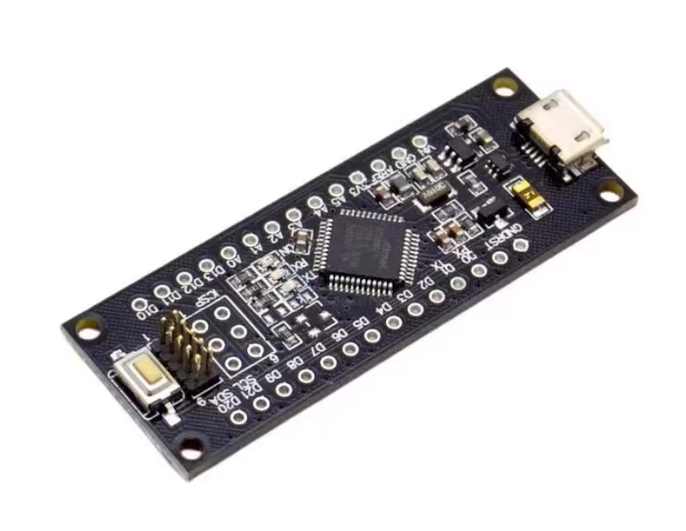

# DOD1104 dat 

[ATSAMD21G18A-AU Mini DEVBoard, Cortex-M0](https://www.electrodragon.com/product/samd21-mini-devlopment-board-m0-atsamd21g18a-au/)

- [[edBG-dat]] - [[SAMD21-dat]]

SAMD21 M0-Mini represents a compact, powerful 32-bit extension of the UNO platform in a Micro/Nano-sized form factor. 

The board uses Atmel's SAMD21 MCU with a 32-bit ARM Cortex-M0+ core and is compatible with Arduino Zero and other M0 boards. The M0-Mini expands the series with higher performance, making it suitable for a wide range of projects and an educational tool for learning 32-bit application development. Typical application areas include IoT devices, wearables, advanced automation, and robotics. 

One important feature is Atmel's Embedded Debugger (EDBG), which provides a full debug interface without extra hardware and significantly improves software debugging usability. EDBG also supports a virtual COM port for device and bootloader programming. Note: some boards may have pin headers with cold solder joints.

Please note this product only have few info on this page. 

## ref 

- [[DOD1104]]